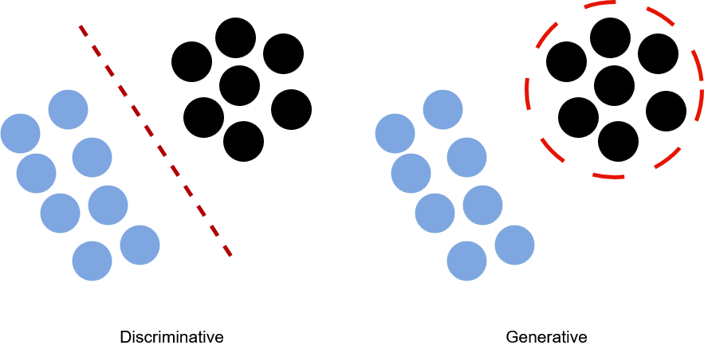
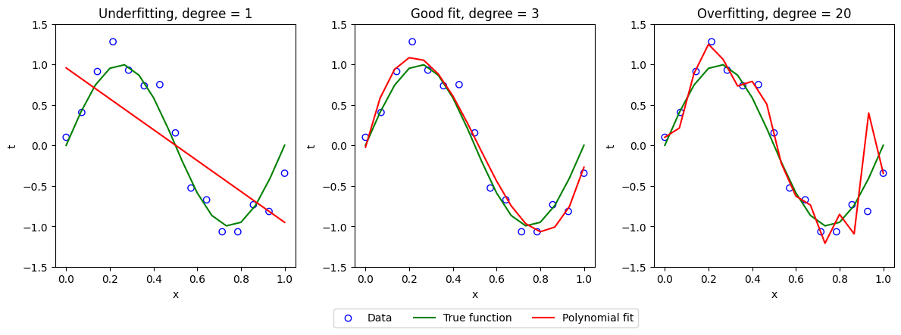
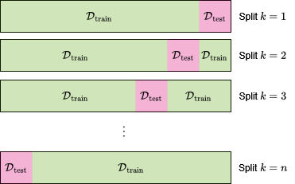
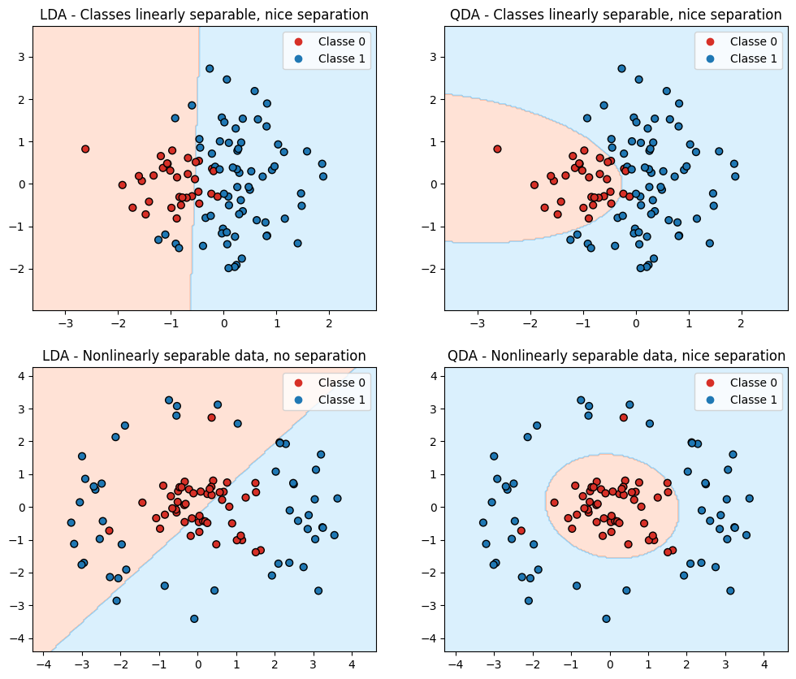
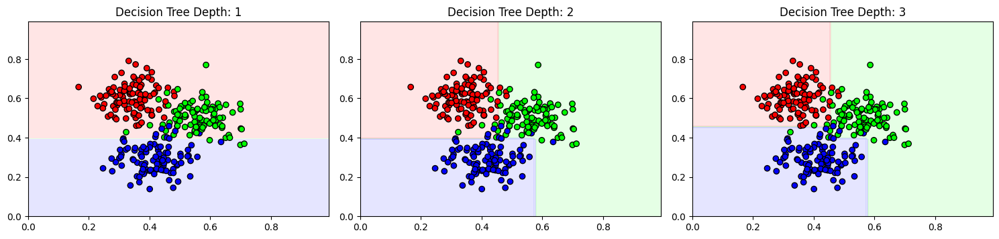
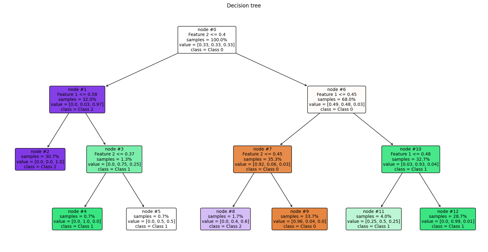

<div style="background-color: #ffdddd; border-left: 5px solid #ff5555; padding: 10px; margin-bottom: 20px;">
  <strong>⚠️ Note :</strong> This page is based on lectures I attended at IMT Nord-Europe, more specifficaly the module "SDATA". This lecture was given by <strong> Vincent Itier</strong>. I adapted some illustrations and examples, but the plan and the content are mainly from the lecture.
</div>

# Classification

> [!tldr] Summary
> A Task of supervised learning (supervised include classfication, but also regression, Reinforcement Learning). Goal: Predict which class a data point is part of.


## Introduction

Given a vector or "'inputs", we want to predict which "class" it belongs to. We assume the set of possible classes $$\mathcal{C}_{1}, \mathcal{C}_{2}, \dots, \mathcal{C}_{K}$$ is known. We also have a set called a **training set** which is a set of items $$\mathcal{D}_{\text{train}} = \{ (\mathbf{x}_{i}, y_{i})\}_{i=1}^{n}$$ in which we know the inputs $$\mathbf{x}_{i}$$ and their corresponding labels $$y_{i}$$. Once a **classifier** is learned, we use it to predict the class $$y^{*}$$ of a new input $$\mathbf{x}^{*}$$.  

The problem can be solved in different ways, a non exhaustive list includes:
- **Direct classification function**: Learn a function **$$f(x) = C_k$$** mapping inputs to classes.
- **Discriminative models**: Learn $$p(C_k \lvert x)$$ as a function of $$\mathbf{x}$$ the probability of each class given the input.
- **Generative models**: Learn $$p(x \lvert C_k)$$, the probability of the input given the class, and use Bayes' rule to infer $$p(C_k \lvert x)$$. Not always make sense, depends on the data.



---
The **loss function** defines the cost of incorrect predictions. Here, we will define $$L_{kj}$$ the loss if we predict an item is in class $$\mathcal{C}_{j}$$ when it is actually in class $$\mathcal{C}_{k}$$. Assume the loss is non negative and $$L_{kk}=0$$. The goal is to predict a class $$\mathcal{C}_{j}$$ which will help minimise the expected loss,$$ \mathcal{L}_{j}=\sum_{k=1}^{K}L_{kj}p(\mathcal{C}_{k}\lvert \mathbf{x}) = \sum_{k=1,k\neq j}^{K}L_{kj}p(\mathcal{C}\lvert \mathbf{x})
$$ The minimal might not be unique. For a binary classification, minimising the expected loss is equivalent to predicted an item is in class $$1$$ if $$ \frac{p(\mathcal{C}_{1}\lvert \mathbf{x})}{p(\mathcal{C}_{0}\lvert \mathbf{x})}\frac{L_{10}}{L_{01}} > 1$$

## Evaluation

We denote $$f$$ a parametric function learned by the learning algorithm. We define a loss function $$L$$.  Generally, the dataset we have **does not describe every possible cases** we might observe in nature. The dataset we have is a subset of all possible cases for our problem. 
One major hypothesis is, we assume the dataset $$\mathcal{D}$$ is **independent and identically distributed** under a data generating function $$p_{X,Y}$$.
The goal is to *minimise* the loss under $$p_{X,Y}$$ (generalisation error):
$$
\text{Err}_{gen}(f)=\mathbb{E}_{X,Y}[L]=\int_{X}\int_{Y}L(y, f(\mathbf{x})) dp_{X,Y}
$$

If the learning algorithm is parametric, then a candidate function $h$ is in bijection with a vector of parameters $$\mathbf{\theta}$$. The function $$f$$ we want to learn is the one corresponding to the 'best' $$\mathbf{\theta}$$.

---

So, we just have to minimise $$\text{Err}_{gen}$$ right? This cannot be explicitly done as the distribution is not known. However, in our supervised case we can compute an **empirical loss** 
$$
\text{Err}_{train}(f, \mathcal{D}) =\frac{1}{N}\sum_{i+1}^{N}L(y_{i}, f(\mathbf{x}_{i}))
$$

This error allows to detect under-fitting (the model is not trained fully yet), but not over-fitting (the model cannot generalise). Data in $$\mathbf{D}$$ are generated from $$p_{X,Y}$$ but $$f$$ is computed from $$\mathbf{D}$$.

#### Illustration of under / over fitting

```python
import numpy as np
import matplotlib.pyplot as plt
from numpy.polynomial.polynomial import Polynomial

# Generate data
np.random.seed(42)
x = np.linspace(0, 1, 15)
y = np.sin(2 * np.pi * x) + np.random.normal(scale=0.2, size=x.shape) # Let's say the data are produced by a sin function and our observations are a little bit noisy

x_fine = np.linspace(0, 1, 16)  # For reference


degrees = [1, 3, 20]
plt.figure(figsize=(12, 4))

for i, d in enumerate(degrees):
    p = Polynomial.fit(x, y, d)
    plt.subplot(1, 3, i+1)
    plt.scatter(x, y, facecolors='none', edgecolors='blue', label="Data")
    plt.plot(x_fine, np.sin(2 * np.pi * x_fine), 'g', label="True function")
    plt.plot(x_fine, p(x_fine), 'r', label=f"Polynomial fit")
    plt.xlabel("x")
    plt.ylabel("t")
    plt.ylim(-1.5, 1.5)

plt.tight_layout()
plt.legend(loc='upper center', bbox_to_anchor=(-0.7, -0.15), ncol=3)
plt.subplot(1, 3, 1)
plt.title(f"Underfitting, degree = {degrees[0]}")
plt.subplot(1, 3, 2)
plt.title(f"Good fit, degree = {degrees[1]}")
plt.subplot(1, 3, 3)
plt.title(f"Overfitting, degree = {degrees[2]}")
plt.show()
```


### Splits

An approach would be to split $$\mathcal{D}$$ in 2, $$\mathcal{D}_{train}, \mathcal{D}_{test}$$. $$\mathcal{D}_{train}$$ used to estimate $f$, then $$\mathcal{D}_{test}$$ used to estimate $$\text{Err}_{gen}$$. $$\text{Err}_{gen}$$ should be small is there is no over-fitting. However, less data are available for the training (estimating $$f$$). 


A solution is to use many splits, this method is known as **K fold cross-validation**.

This method require $$K$$ learning phase which can be costly.




### Summary

- In theory we want $$\text{Err}_{gen} \approx 0$$
- In practice we ensure $$\text{Err}_{train} \approx 0$$ and $$\text{Err}_{train} \approx \text{Err}_{gen}$$

### Metrics

We can also look at several metrics. Another page concerning metric will be uploaded, hopefully, the following list will link to those new notes.. (or not)
- [[Metric]]


## Generative Models for Classification

Nota: Here I talked about **generative** but I will not especially talk on LLMs :) (sorry)

A generative model uses a probabilistic 'model' for each class, the decision boundary is decided based on where one model becomes more likely.

Given a data point $$\mathbf{x}$$, we want $$p(\text{class}\lvert \mathbf{x})$$. It can be directly estimated by regression or we can assume a model for $$p(\mathbf{x} \lvert \text{class})$$ and a prior $$p(\text{class})$$ and using Bayes' rule to get $$p(\text{class}\lvert \mathbf{x})$$.

We learn models for $$p(\mathbf{x}, \lvert \mathcal{C}_{k}),\ k=1,2,\dots,K$$. But to do classification we actually need $$p(\mathcal{C}_{k} \lvert \mathbf{x})$$. We can get this pdf using Bayes' Rule:

$$
p(\mathcal{C}_{k} \lvert \mathbf{x}) = \frac{p(\mathcal{C}_{k})p(\mathbf{x}\lvert \mathcal{C}_{k})}{\sum_{j=1}^{K}p(\mathcal{C}_{j})p(\mathbf{x}\lvert \mathcal{C}_{j})}
$$

The prior of a class $$k$$, $$\mathcal{C}_{k}$$ can be estimated by the frequencies of the classes in the training data, or from expert knowledge for instance. 


For binary classification, we have for instance:

$$
p(\mathcal{C}_{1} \lvert \mathbf{x}) = \frac{p(\mathcal{C}_{1})p(\mathbf{x}\lvert \mathcal{C}_{1})}{p(\mathcal{C}_{0}) p(\mathbf{x}\lvert \mathcal{C}_{0})
+ p(\mathcal{C}_{1})p(\mathbf{x}\lvert \mathcal{C}_{1})} 
$$

### Naive Bayes Models

For simplicity, suppose the inputs is a binary vector. We can use a simple generative model being:
$$
p(\mathbf{x} \lvert \mathcal{C}_{k})= \prod_{i=1}^{p}\theta_{ki}^{\mathbf{x}_{i}}(1-\theta_{ki}^{\mathbf{x}_{i}})^{1-\mathbf{x}_{i}}
$$

This product assumes **independence** accross dimensions, $$p(\mathbf{x}\lvert \mathcal{C}_{k}) = p(x_{1}\lvert \mathcal{C}_{k}) \cdot p(x_{2}\lvert \mathcal{C}_{k}) \ldots p(x_{p}\lvert \mathcal{C}_{k})$$. Here $$\theta_{ki}$$ is the estimated probability that $$i$$ will have the value $$1$$ in items from the class $$k$$.

This method is called **[[NaiveBayes]]** model.
- *Bayes* because we use the Bayes' rule to perform classification
- *naive* because it assumes all inputs are **independent given the class**, which is usually not true.

If we are assuming also a binary classification task, we have:

$$
\begin{aligned}

p(\mathcal{C}_{1} \lvert \mathbf{x}) &= \frac{p(\mathcal{C}_{1})p(\mathbf{x}\lvert \mathcal{C}_{1})}{p(\mathcal{C}_{0}) p(\mathbf{x}\lvert \mathcal{C}_{0})
+ p(\mathcal{C}_{1})p(\mathbf{x}\lvert \mathcal{C}_{1})} 
\\
&=\frac{1}{p(\mathcal{C}_{0})p(\mathbf{x}\lvert \mathcal{C}_{0}) / p(\mathcal{C}_{1})p(\mathbf{x}\lvert \mathcal{C}_{1})}
\\
&= \frac{1}{1 + \exp(- \alpha(\mathbf{x}))}
\end{aligned}
$$

where

$$
\begin{aligned}

\alpha(\mathbf{x}) &= \log\left(\frac{p(\mathcal{C}_{1})p(\mathbf{x}\lvert \mathcal{C}_{1})}{p(\mathcal{C}_{0})p(\mathbf{x}\lvert \mathcal{C}_{0})} \right)
\\
&= \log\left( \frac{p(\mathcal{C}_{1})}{p(\mathcal{C}_{0})}\prod_{i=1}^{p}\left(\frac{\theta_{1i}}{\theta_{0i}} \right)^{\mathbf{x}_{i}} \left( \frac{1 - \theta_{1i}}{1 - \theta_{0i}} \right)^{1 - \mathbf{x}_{i}} \right)
\\
&= \log \left( \frac{p(\mathcal{C}_{1})}{p(\mathcal{C}_{0})} \prod_{i=1}^{p}\frac{1 - \theta_{1i}}{1 - \theta_{0i}} \right) + \sum_{i=1} \mathbf{x}_{i}\log\left(
\frac{\theta_{1i}/(1- \theta_{1I})}
{\theta_{0i}/(1 - \theta_{0i})}
\right)
\end{aligned}
$$

If instead, the inputs are not binary but real-valued, a Gaussian model for the distribution of inputs in each class can be used. The resulting technique is called a **Gaussian Discriminant Analysis** (GDA).

### GDA

We use a Gaussian model for the distribution of the inputs in each class, $$p(\mathbf{x}\lvert \mathcal{C}_{k}) = \mathcal{N}(\mathbf{x} \lvert \Sigma_{k})$$. If $$\Sigma_{k}$$ is diagonal, this is equivalent to a Naive Bayes Classifier (we suppose independence between inputs given a class).  

The classification is done using a rule based on the posterior, 
$$
\hat{\mathcal{C}}_{k}^{*}=\arg\max_{\mathcal{C}_{k}}p(\mathcal{C}_{k}\lvert \mathbf{x}) = \arg \max_{\mathcal{C}_{k}}\log[p(\mathcal{C}_{k}) p(\mathbf{x}\lvert \mathcal{C}_{k})] =
\arg\max_{\mathcal{C}_{k}}[\log p(\mathcal{C}_{k})] + \log p(\mathbf{x}\lvert \mathcal{C}_{k})
$$

with $$\log p(\mathbf{x}\lvert \mathcal{C}_{k}) = \frac{-1}{2}\log \lvert \Sigma_{k}\lvert^{\frac{-1}{2}} - \frac{1}{2}(\mathbf{x} - \mu_{k})^{T}\Sigma_{k}^{-1}(\mathbf{x} - \mu_{k})$$. In practice, the vectos $$\mu_{k}$$ and $$\Sigma_{k}$$ are obtained using the Maximum Likelihood criterion, thus leading to 

$$
\mu_{k}= \frac{1}{N_{k}}\sum_{j \in \Omega_{k}}\mathbf{x}_{j} \quad \text{and}\quad \Sigma_{k}=\frac{1}{N_{k}}\sum_{j \in \Omega_{k}}(\mathbf{x}_{j} - \mu_{k})(\mathbf{x}_{j} - \mu_{k})^T
$$

where $$\Omega_{k}= \{1,2,\dots,N \lvert y_{i}=\mathcal{C}_{k} \}$, $N_{k}= \lvert \Omega_{k}\lvert$$.

and with 
$$
p(\mathcal{C}_{k} \lvert \mathbf{x}) = \frac{p(\mathcal{C}_{k})p(\mathbf{x}\lvert \mathcal{C}_{k})}{\sum_{j=1}^{K}p(\mathcal{C}_{j})p(\mathbf{x}\lvert \mathcal{C}_{j})}
$$
we can rewrite 
$$
p(\mathcal{C}_{k} \lvert \mathbf{x}) \sim f_{k}(\mathbf{x})\pi_{k}
$$
with
$$
f_{k}(\mathbf{x})=  \frac{1}{\sqrt{(2\pi)^{p}\det\Sigma_{k}}}\exp\left[-\frac{1}{2}(\mathbf{x}-\mu_{k})^{T}\Sigma_{k}^{-1}(\mathbf{x}- \mu_{k}) \right]
$$

### Quadratic Discriminant Analysis (QDA)

Consider a binary classification problem with $$\pi_{1}= \pi_{2}=\frac{1}{2}$$.

The decision boundary is given by the equality $$p(\mathcal{C}_{0}\lvert \mathbf{x}) = p(\mathcal{C}_{1}\lvert \mathbf{x})$$, which is 

$$
\log \det \Sigma_{0} - \frac{1}{2}(\mathbf{x}- \mu_{0})^{T}\Sigma_{0}^{-1}(\mathbf{x}- \mu_{0}) = \log \det \Sigma_{1} - \frac{1}{2}(\mathbf{x}- \mu_{0})^{T}\Sigma_{0}^{-1}(\mathbf{x}- \mu_{0})
$$

### Linear Discriminant Analysis (LDA)

In addition to the previous assumptions, suppose now $$\Sigma_{0}= \Sigma_{1} = \Sigma$$. The decision boundary is given by the equality $$p(\mathcal{C}_{0}\lvert \mathbf{x}) = p(\mathcal{C}_{1}\lvert \mathbf{x})$$, which is

$$
(\mathbf{x} - \mu_{0})^{T}\Sigma^{-1}(\mathbf{x} - \mu_{0}) = (\mathbf{x} - \mu_{1})^{T}\Sigma^{-1}(\mathbf{x} - \mu_{1})
$$

Then

$$
2 \mathbf{x}^{T}\Sigma^{-1}(\mathbf{x}- \mu_{1}) = \mu_{0}\Sigma^{-1}\mu_{0}-\mu_{1}\Sigma^{-1}\mu_{1} = \text{constant}
$$

Thus, **Linear Discriminant Analysis** is a projection of $$\mathbf{x}$$ onto the $$\Sigma^{-1}(\mu_{0}- \mu_{1})$$ direction.

- If the covariance matrix is spherical, this method is then called a **nearest centroid classifier**

```python
import numpy as np
import matplotlib.pyplot as plt
from sklearn.discriminant_analysis import LinearDiscriminantAnalysis, QuadraticDiscriminantAnalysis
from matplotlib.colors import ListedColormap

def plot_decision_boundary(clf, X, y, ax, title):
    x_min, x_max = X[:, 0].min() - 1, X[:, 0].max() + 1
    y_min, y_max = X[:, 1].min() - 1, X[:, 1].max() + 1
    xx, yy = np.meshgrid(np.linspace(x_min, x_max, 200), np.linspace(y_min, y_max, 200))
    
    Z = clf.predict(np.c_[xx.ravel(), yy.ravel()])
    Z = Z.reshape(xx.shape)

    cmap_background = ListedColormap(["#FFA07A", "#87CEFA"])  
    cmap_points = ListedColormap(["#D73027", "#1F78B4"])  
    
    ax.contourf(xx, yy, Z, alpha=0.3, cmap=cmap_background)
    scatter = ax.scatter(X[:, 0], X[:, 1], c=y, cmap=cmap_points, edgecolor="k", s=40)
    
    ax.set_title(title)
    ax.set_xlim(x_min, x_max)
    ax.set_ylim(y_min, y_max)
    ax.legend(handles=scatter.legend_elements()[0], labels=["Classe 0", "Classe 1"], loc="upper right")

# Generate data
np.random.seed(42)
X_linear = np.random.randn(100, 2)
y_linear = (X_linear[:, 0] + X_linear[:, 1]**2 > 0).astype(int)  

## Generate nonlinear data
mean_center = [0, 0]
cov_center = [[0.5, 0], [0, 0.5]]
X_center = np.random.multivariate_normal(mean_center, cov_center, 50)

r = 3 + np.random.randn(50) * 0.5  
theta = np.random.rand(50) * 2 * np.pi  
X_ring = np.column_stack((r * np.cos(theta), r * np.sin(theta))) 

X_nonlinear = np.vstack((X_center, X_ring))
y_nonlinear = np.hstack((np.zeros(50), np.ones(50)))

# Fit LDA and QDA
lda_linear = LinearDiscriminantAnalysis()
qda_linear = QuadraticDiscriminantAnalysis()
lda_nonlinear = LinearDiscriminantAnalysis()
qda_nonlinear = QuadraticDiscriminantAnalysis()

lda_linear.fit(X_linear, y_linear)
qda_linear.fit(X_linear, y_linear)
lda_nonlinear.fit(X_nonlinear, y_nonlinear)
qda_nonlinear.fit(X_nonlinear, y_nonlinear)
fig, axs = plt.subplots(2, 2, figsize=(12, 10))

plot_decision_boundary(lda_linear, X_linear, y_linear, axs[0, 0], "LDA - Classes linearly separable, nice separation", )
plot_decision_boundary(qda_linear, X_linear, y_linear, axs[0, 1], "QDA - Classes linearly separable, nice separation")
plot_decision_boundary(lda_nonlinear, X_nonlinear, y_nonlinear, axs[1, 0], "LDA - Nonlinearly separable data, no separation")
plot_decision_boundary(qda_nonlinear, X_nonlinear, y_nonlinear, axs[1, 1], "QDA - Nonlinearly separable data, nice separation")

```




## Discriminative Models for Classifications

### Gaussian Process

I plan to write a  note on that later...

### Linear/Logistic Regressions
Same
### Large Margin Classifiers

Large Margin Classifiers are a category of classifier, basis of the well known **Support Vector Machine** classifier. These methods produce only a predicted class, not probabilities. The idea is to pick the hyperplane separating the classes with the highest **margin** (minimum distance of a data point from the boundary). In their simplest form, they are only applicable to perfectly separable binary classification tasks.

We will consider such a case, and denote the labels as either $$1$$ or $$-1$$. We can define an hyperplane by $$w^{T}\mathbf{x} + b = 0$$, and we will classify the data points to the class $$\text{sign}(w^{T}\mathbf{x} + b)$$. 

For training, we will impose the constraint that the training samples are correctly classifier, that is 

$$
y_{i}(w^{T}\mathbf{x}+b)>0,\quad i=1,2,\dots,N
$$

while also maximising the margin being

$$
\underset{i=1,2,\dots,N}{\min}\frac{y_{i}(w^{T}\mathbf{x}+b)}{\lVert w \lVert}
$$

Which is equivalent to 

$$
\min{\lVert w \lVert}^{2}, \quad \text{subject to } y_{i}(w^{T}\mathbf{x}+b) \geq 1, \ i=1,2,\dots,N
$$

The minimum is obtained when the equality condition is met, so the margin will be $$\frac{1}{\lVert w \lVert}$$. Maximising the margin is equivalent to minimising $$\lVert w \lVert$$. 

This optimisation is a convex optimisation problem which can be solved efficiently. **However** the solution is locally sensitive to a subset of training data points called support vectors.


Moreover, this method suppose the classes can be separated  linearly, which in general is not the case.. Fortunately, an extension of this algorithm is designed for such cases.

#### Support Vector Machines (SVM)

Same, more detailed note to come
The classes might not be linearly separable in the original space of the data points, but they can be in another space, we use a vector of basis functions $$\varPhi(\mathbf{x}) = [\varPhi_{1}(\mathbf{x}), \varPhi_{2}(\mathbf{x}), \dots, \varPhi_{m}(\mathbf{x})]^{T}$$. This trick is called the **kernel trick**. 

## Decision Trees

Decision trees are a type of model used for both classification and regression tasks.  

- When the target variable is discrete, the model is called a **classification tree**.
  - Leaves represent class labels.
  - Branches represent conjunctions of features that lead to those class labels.
- When the target variable is continuous, the model is called a **regression tree**.

### Introduction

Classification And Regression Trees (CART, *Breiman*, *1984*), or simply decision trees are methods defined by recursively partitioning the input data space, defining a local model in each region. This can be representing using a **tree**, will thus leaves and nodes. At each nodes, a question is asked to divide the data space into 2 sub spaces. Depending on the value of the data point, they are affected to one or the other subspace.

For an elementary binary classification task, with binary variables: $$X_{i}\in \{ 0, 1\}, Y_{i}\in \{0,1\}$$ and a learning dataset of size $$n$$, we can build the corresponding contingency table.

| $$Y$$ / $$X$$ | $$X = 0$$        | $$X = 1$$        | Total   |
| --------- | -------------- | -------------- | ------- |
| $$Y = 0$$   | $$n_{0\lvert0}$$ | $$n_{0\lvert1}$$ | $$n_{0}$$ |
| $$Y = 1$$   | $$n_{1\lvert0}$$ | $$n_{1\lvert1}$$ | $$n_{1}$$ |
| **Total** | $$n_{:0}$$       | $$n_{:1}$$       | $$n$$     |

Where:
- $$n_{0\lvert 0}$$ and $$n_{0 \lvert 1}$$ are the counts of class $$Y = 0$$  given $$X = 0$$ and $$X = 1$$.
- $$n_{1\lvert 0}$$ and $$n_{1 \lvert 1}$$ are the counts of class $$Y = 1$$  given $$X = 0$$ and $$X = 1$$.
- $$n_{:\lvert 0}$$ and $$n_{: \lvert 1}$$ are the total counts for $$X = 0$$ and $$X = 1$$.
- $$n_0$$ and $$n_1$$ are the total counts for each class.
- $$n$$ is the total number of observations.
We denote $$P(Y=k \lvert X = l) = \pi_{k\lvert l}$$. Using MLE:

$$
\hat{\pi}_{k\lvert l} = \frac{n_{k \lvert l}}{n_{0\lvert l}+n_{1 \lvert l}}
$$

The decision can be made with a 0/1 cost function 

$$
f(x) = \begin{cases}
 1 \quad \text{if } n_{1 \lvert x} > n_{0 \lvert x} \\
0 \quad \text{otherwise}
 \end{cases}
$$

More generally, when building a decision tree, there are three questions which need to be answered:
- How to ask good questions? (to divide the data space)
- What are good answers? (how to decide)
- How to keep only relevant questions? (reduce the complexity)

### Construction


Suppose we have a set for training $$\{X_{i}, i=1,2,\dots,n\}$$. The tree is obtained through successive binary splits of the set, each leaf node representing a decision rule. The prediction will be the leaf associated with the input.

Each split in the tree is based on **only one variable**. For instance, if $$X_{j} \in \{1,2,\dots,M\}$$ a decision rule is "$$X_{j}\in A?$$", $$A\subset \{0,1,\dots,M\}$$. If $$X_{j}\in \mathbb{R}$$ and the training set is finite, then there exists a finit number of questions $$X_{j}\leq c$$.

Basically, the algorithm is
```python
Recursive construction of a decision tree
Procedure Build-tree (node m)
Begin
	if Every points of m belong to the same class
		then Make a leaf denoted by the class name
	else
		Chose the best predicate to make a node
		Test predicate in order to split m into two child nodes mL and mR
		Build-tree (mL)
		Build-tree (mR)
	end
end
```

Some steps still need definition here. For that we define the notion of a **node impurity**:

Let $$R_{m}$$ be a set of $$N_{m}$$ training data point at the node $$m$$, we can write 

$$
p_{m,k}= \frac{1}{N_{m}}\sum\limits_{x_{i}\in R_{m}}\mathbb{1}(\{y_{i}=k\})
$$ 

the frequency of each class $$k$$ at node $$m$$. We also define $$d(m) = \arg \underset{k}{\max}p_{m,k}$$. We want to split $$R_{m}$$ into two. How to measure the splitting rule quality? We define an **impurity function** $$\varPhi$$ defined on $$(p_{1}, p_{2}, \dots, p_{K})$$ with $$p_{k}\leq 0$$ and sum to 1, such that
- $$\varPhi$$ has a unique maximum at $$(\frac{1}{K}, \frac{1}{K}, \dots, \frac{1}{K})$$
- $$\varPhi$$ is minimal at points such as $$(1, 0, 0, \dots, 0)$$, $$(0,1,0,0, \dots ,0)$$,etc.
- $$\varPhi(p_{1}, p_{2}, \dots, p_{K}) = \varPhi(p_{\pi(1)}, p_{\pi{2}}, \dots, p_{\pi(K)})$$ for any perturbation $$\pi$$.

Some standard impurity metrics include:

* **Classification error** 
$$
\frac{1}{N_{m}}\sum\limits_{i \in R_{m}}\mathbb{1}(\{y_{i}\neq d(m) \}) = 1 - p_{m, d(m)}
$$

* **Gini index** 
$$
\sum\limits_{k \neq k^{'}}p_{m,k}p_{m,k^{'}}= \sum_{k=1}^{K}p_{m,k}(1 - p_{m,k})
$$

* **Cross-entropy**
$$
 -\sum_{k=1}^{K}p_{mk}\log p_{m,k}
$$

For instance if $$k=2$$ and the probability for the second class is $$p$$: 
- **Classification error** = $$1 - \max(p, 1-p)$$
- **Gini index**= $$2p(1-p)$$
- **Cross-entropy** = $$-p \log(p) - (1 - p) \log(1 - p)$$

Now that we can estimate a node impurity, we can estimate a splitting quality:

Let $$m_L$$ (left) and $$m_{R}$$ be children of the node $$m$$. The **splitting quality** at node $$m$$  given a splitting $$s$$ is given by $$\Delta \varPhi(s, m)=  \varPhi(p_{m}) - \left( \pi_{L}\varPhi(p_{m_{L}}) + \pi_{R}\varPhi(p_{m_{R}}) \right)$$ with $$\pi_{L}, \pi_{R}$$ the proportion of data in the left and right nodes. To chose the split $$s$$, we can exhaustively compute every possiblity for moderate datasets, or when the quality satsifies a pre-defined threshold. But this is not efficient.

The best strategy is to **build a deep tree** $$T_{0}$$ and stop when a minimal size is reach at a node, then **prune** branches based on a complexity criterion

```python
import numpy as np
import matplotlib.pyplot as plt
from sklearn.datasets import make_blobs
from sklearn.tree import DecisionTreeClassifier, plot_tree
from matplotlib.colors import ListedColormap

# Generate data
centers = [(0.35, 0.6), (0.55, 0.5), (0.42, 0.3)]
X, y = make_blobs(n_samples=300, centers=centers, random_state=42, cluster_std=0.07)


x_min, x_max = 0, 1
y_min, y_max = 0, 1
xx, yy = np.meshgrid(np.arange(x_min, x_max, 0.01),
                     np.arange(y_min, y_max, 0.01))

# Train a decision tree classifier
clf = DecisionTreeClassifier(random_state=42, max_depth=3)
clf.fit(X, y)

# Plot the decision boundaries at each depth
plt.figure(figsize=(15, 10))
for i, depth in enumerate(range(1, clf.get_depth() + 1)):
    plt.subplot(3, 3, i + 1)
    clf_depth = DecisionTreeClassifier(max_depth=depth, random_state=42)
    clf_depth.fit(X, y)
    Z = clf_depth.predict(np.c_[xx.ravel(), yy.ravel()])
    Z = Z.reshape(xx.shape)
    plt.contourf(xx, yy, Z, alpha=0.3, cmap=ListedColormap(['#FFAAAA', '#AAFFAA', '#AAAAFF']))
    plt.scatter(X[:, 0], X[:, 1], c=y, edgecolors='k', cmap=ListedColormap(['#FF0000', '#00FF00', '#0000FF']))
    plt.title(f'Decision Tree Depth: {depth}')
plt.tight_layout()
plt.show()

# Plot the decision tree
plt.figure(figsize=(20, 10))
plot_tree(clf, filled=True, feature_names=['Feature 1', 'Feature 2'], class_names=['Class 0', 'Class 1', 'Class 2'],
          impurity=False, proportion=True, rounded=True, precision=2,
          node_ids=True, label='all', fontsize=10, ax=None, max_depth=None,)
plt.title("Decision tree")
plt.show()
```




### Pruning

We define a complexity-cost criterion of  a tree $$T$$ as $$C_{\alpha}(T)=  \sum_{m=1}^{\lvert T \lvert} N_{m}\varPhi(p_{m}) + \alpha \lvert T \lvert$$
with $$\lvert T \lvert$$ number of leafs. The parameter $$\alpha$$ controls the complexity
- $$\alpha=0$$ corresponds to $$T_{0}$$
- $$\alpha$$ large: induces low depth tree.

For a fixed complexity parameter $$\alpha$$, find a sub-tree $$T_{\alpha} \subseteq T_{0}$$ minimising $$C_{\alpha}$$.  