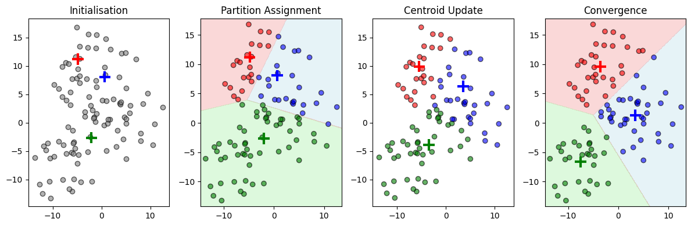

<div style="background-color: #ffdddd; border-left: 5px solid #ff5555; padding: 10px; margin-bottom: 20px;">
  <strong>⚠️ Note :</strong> This page is based on lectures I attended at IMT Nord-Europe, more specifficaly the module "ODATA". This lecture was given by <strong> Christell Garnier</strong>. I adapted some illustrations and examples, but the plan and the content are mainly from the lecture.
</div>


> [!tldr]
> Clustering, or non supervised learning, aims to divide a dataset into multiples groups in such a way that similar data points are grouped together while dissimilar ones are separated. This process refereed to as **partitioning** or **segmentation**. 


## Introduction

### Objective

The objective is to group similar data point while separating dissimilar data points. The application can be: categorise documents per category, identify communities in social networks, define clients profile etc.

We are in a non supervised setting, 
- We do **not** know the different classes or their number
- We directly try to create the classes based on the variable present in the data

### Formalisation of a clustering problem

- Inputs: a set of data $$\mathcal{\mathbf{X}} = \{ \mathbf{x}_{1}, \dots, \mathbf{x}_{i}, \dots, \mathbf{x}_{n} \}$$
	- $$\mathbf{x}_{i}$$ is a vector $$[x_{i}^{1}, \dots, x_{i}^{j}, \dots, x_{i}^{p}]^{T}\in \mathbb{R}^{p}$$ with $$p$$ feature of a data point $$i$$
- Outputs: A partition of $$\mathbf{\mathcal{X}}$$ into $$K$$ classes : $$\mathcal{P} = \{ \mathcal{C}_{1}, \mathcal{C}_{2}, \dots, \mathcal{C}_{K} \}$$. 
- Objective: To find the best partition $$\mathcal{P}$$ possible with respect to a specified criteria. 

It is a combinatorial optimisation problem. Easy in theory, you just have to try every possible combination and compare them to find the best one. In practice, this may not be doable in your lifespan! Indeed, the number of partitions of $$n$$ elements into $$k$$ classes $$S(n, k) = \frac{1}{k!}\sum_{j=1}^{k}(-1)^{k-j}C_{j}^{k}j^{n}$$, the total number of partitions is $$\mathcal{B}(n) = \sum_{k=1}^{n}S(n, k)$$. For $$n=10$$, Bell's number is already ~100000

### Main approaches

It is not realistic to optimise the considered criterion on all the possible partitions. Instead we use an iterative method which explore a subset of partitions and hope for the best! 
The principe is:
- Start with an initial partition
- Iterate a processus which upgrade the partitioning by moving some data points from one cluster to another

There are numerous methods for unsupervised classification. Here we will focus on two major families:

- **Partitioning** methods
	- Exploratory methods based on geometric considerations.
	- The goal is to group similar data points according to a proximity/similarity measure.
- **Probabilistic methods**
	- Methods based on statistical modeling of the population using a mixture of distributions.
	- The goal is to cluster homogeneous data points that originate from the same probability distribution.

## The data

For the notation, refer to  [ML Notations](/notes/ml-basis/ml-notations "ML Notation")

## Partitioning methods

### Formalisation of a partitioning problem

Find the partition $$\mathcal{P}$$ of the set $$\mathcal{\mathbf{X}}$$ into $$K$$ clusters $$\{\mathcal{C}_{1}, \mathcal{C}_{2}, \dots, \mathcal{C}_{K}\}$$ that minimises a cost function formulated based on a similarity criterion defined on $$\mathcal{\mathbf{X}}$$.
The goal is to decompose the heterogeneous dataset into subsets (classes, clusters) such that:
- **Similar data points are grouped within the same homogeneous subset** ⟷ grouping together similar elements.
- **Dissimilar data points are placed in separate subsets** ⟷ separating different elements.

### Distance between data points

To measure a similarity or proximity between 2 data points $$i$$ and $$l$$, we need to define a distance between $$\mathbf{x}_{i}$$ and $$\mathbf{x}_{l}$$ taking features into account. Which one to chose?

#### Case of real valued quantitative data

- Minkowski ($$L_{q}$$):
$$
d(\mathbf{x}_{i}, \mathbf{x}_{l})=\lVert \mathbf{x}_{i}- \mathbf{x}_{l}\lVert_{q}=\left( \sum_{j=1}^{p}\lvert x_{i}^{j}-x_{l}^{j}\lvert ^{q} \right)^{\frac{1}{q}}
$$
- Euclidean distance $$q=2$$,
$$
d(\mathbf{x}_{i}, \mathbf{x}_{l}) = \lVert \mathbf{x}_{i}- \mathbf{x}_{l}\lVert_{2}= \sqrt{\sum_{j=1}^{p}(x_{i}^{j}-x_{j}^{j})^{2}}=\sqrt{(\mathbf{x}_{i}-\mathbf{x}_{l})^{T}(\mathbf{x}_{i} -\mathbf{x}_{l})}
$$
- Manhattan, $$q=1$$:
$$
d(\mathbf{x}_{i}, \mathbf{x}_{l}) = \lVert \mathbf{x}_{i}- \mathbf{x}_{l}\lVert_{1} = \sum_{j=1}^{p}\lvert x_{i}^{j}-x_{l}^{j}\lvert
$$
- Tchebychev, $$q=\infty$$:
$$
d(\mathbf{x}_{i}, \mathbf{x}_{l}) =  \lVert \mathbf{x}_{i}- \mathbf{x}_{l}\lVert_{\infty} = \underset{q \to \infty}{\lim}\left( \sum_{j=1}^{p}\lvert x_{i}^{j}-x_{l}^{j}\lvert^{q} \right)^{\frac{1}{q}} = \underset{1\leq j \leq p}{\sup}\lvert x_{i}^{j}- x_{l}^{j}\lvert
$$
- A distance defined from a metric $$\mathbf{M}$$, where $$\mathbf{M}$$ is a squared, positive semi-definite matrix:
$$
d_{\mathbf{M}}(\mathbf{x}_{i}, \mathbf{x}_{l}) =  \lVert \mathbf{x}_{i}- \mathbf{x}_{l}\lVert_{\mathbf{M}} =\sqrt{(\mathbf{x}_{i}- \mathbf{x}_{l})^{T}\mathbf{M}(\mathbf{x}_{i}- \mathbf{x}_{l})}
$$
- Mahalanobis, $$\mathbf{M} = \mathbf{V}^{-1}$$,
	- If $$\mathbf{V} = \mathbf{I}_{p}$$ (uncorrelated standardised data) $$d_{\mathbf{M}} = d_{2}$$
	- If $$\mathbf{V} = \text{diag}(s_{1}^{2}, s_{2}^{2}, \dots, s_{p}^{2})$$ (uncorrelated non standardised data), the distance is the weighted Euclidean distance $$d_{\mathbf{M}}(\mathbf{x}_{i}, \mathbf{x}_{l}) = \sqrt{\sum_{j=1}^{p}\frac{(x_{i}^{j}-x_{l}^{j})^{2}}{s_{j}^{2}}}$$
	- If the matrix is not diagonal, the Mahalanobis distance reduces the correlation between variables.

#### Case of discrete quantitative data

For binary variables / letters:
- Hamming distance$$
d(\mathbf{x}_{i}, \mathbf{x}_{l}) = \text{number of different elements between }\mathbf{x}_{i}​ \text{ and } \mathbf{x}_{l}
$$
- Similarity index based on:
  - $$a_{il}$$: common elements
  - $$b_{il}$$ : in $$x_i$$ but not in $$x_l$$
  - $$c_{il}$$ in  $$x_l$$ but not in $$x_i$$
  - $$d_{il}$$ neither in $$x_i$$ nor in $$x_l$$

- **Concordance Index**:  
  $$d(x_i, x_l)= a_{il} + d_{il}$$

- **Jaccard Index**:  
  $$d(x_i, x_l) = \frac{a_{il}}{a_{il} + c_{il} + c_{il}}$$ 

for character strings:  

- **Levenshtein Distance**:  
  - Number of insertions, deletions, or replacements needed.  


### Geometric characteristic of a cluster

Similar to a cloud of data points, each cluster can be characterised by its gravity centre, its covariance matrix and its inertia.

#### Gravity centre of a cluster $$\mathcal{C}_{k}$$

The gravity centre of a cluster $$\mathcal{C}_{k}$$ with $$n_{k}=\text{card}(\mathcal{C}_{k})$$ is defined as the mean of the data points in the cluster:$$
\mathbf{g}_{k}= \frac{1}{n_{k}}\sum_{\mathbf{x}_{i}\in \mathcal{C}_{k}}\mathbf{x}_{i}
$$
#### Covariance matrix of a cluster $$\mathcal{C}_{k}$$

The covariance matrix $$\mathbf{V}_{k}$$ of a cluster $$\mathcal{C}_{k}$$ is defined as:$$
\mathbf{V}_{k}=\sum_{\mathbf{x}_{i}\in \mathbf{C}_{k}}(\mathbf{x}_{i}- \mathbf{g}_{k})(\mathbf{x}_{i}-\mathbf{g}_{k})^{T}
$$
#### Inertia of a cluster $\mathcal{C}_{k}$

The inertia of a cluster $$\mathcal{C}_{k}$$ is defined as the sum of the squared distances between points in a cluster and its gravity centre $$\mathbf{g}_{k}$$:$$
I_{k}=\sum_{\mathbf{x}_{i}\in \mathcal{C}_{k}}d^{2}(\mathbf{x}_{i}, \mathbf{g}_{k})=\sum_{\mathbf{x}_{i}\in \mathcal{C}_{k}}\lVert \mathbf{x}_{i}-\mathbf{g}_{k}\lVert^{2}
$$

### Criterion to optimise

Let a cloud of $$n$$ data points, spread into $$K$$ distinct clusters. Each cluster $$\mathcal{C}_{k}$$ groups $$n_{k}$$ data point and has $$\mathbf{g}_{k}$$ as its gravity centre.
The inertia of the data cloud can be written as:$$
\begin{aligned}
I =& \sum_{i=1}^{n}\lVert\mathbf{x}_{i}- \mathbf{g} \lVert^{2}= \sum_{k=1}^{K}\sum_{\mathbf{x}_{i}\in \mathcal{C}_{k}}\lVert \mathbf{x}_{i}-\mathbf{g}\lVert^{2}
\\
&=\sum_{k=1}^{K}\sum_{\mathbf{x}_{i}\in \mathcal{C}_{k}}\lVert \mathbf{x}_{i}-\mathbf{g}_{k}+\mathbf{g}_{k} - \mathbf{g}\lVert^{2}
\\
&=\sum_{k=1}^{K}\sum_{\mathbf{x}_{i}\in \mathcal{C}_{k}} \lVert \mathbf{x}_{i}-\mathbf{g}_{k}\lVert^{2}+\lVert \mathbf{g}_{k}- \mathbf{g}\lVert^{2}
\\
=&\sum_{k=1}^{K}\sum_{\mathbf{x}_{i}\in \mathcal{C}_{k}}d^{2}(\mathbf{x}_{i}, \mathbf{g}_{k}) + \sum_{k=1}^{K}n_{k}d^{2}(\mathbf{g}_{k},\mathbf{g})
\\
&=I_{W}+I_{B}
\end{aligned}
$$
- $$I_{W}$$ is the within-class inertia.
	- It is the sum of the squared distances between data points of each class and their gravity centre, which represent the **dispersion**. 
	- It is to be minimised to have homogeneous clusters.
- $$I_{B}$$ is the between class inertia.
	- It is the weighted squarred sum of the distances between gravity centres of each class and the gravity centre of the whole cloud of data point, which represents **how far away** each cluster's centres are.
	- It is to be maximised to have clear clusters. 

#### Objective of a partitioning algorithm

To find the partition $$\mathcal{P}$$ into $$K$$ clusters $$\{\mathcal{C}_{1}, \mathcal{C}_{2},\dots, \mathcal{C}_{K} \}$$ which minimised the within-class inertia:$$
I_{W}= \sum_{k=1}^{K}\sum_{\mathbf{x}_{i}\in \mathcal{C}_{k}}d^{2}(\mathbf{x}_{i}, \mathbf{g}_{k})
$$
We can decomposed the family of partitioning algorithm between 2 families: 

- **Non Hierarchical methods**
	- Principle: Consider all the data simultaneously
	- Main approaches based onto centroids: K-means and its variants, K-medoids, K-medians etc.
- **Hierarchical methods**
	- Principe: Build a sequence of nested partitions 
	- Bottom-up (aggregation) or top-down (division) approach

These methods are called heuristic because they provide an approximate solution to the minimisation problem.

### K-means algorithm

Probably the best known clustering algorithm.
- The number of clusters $$K$$ is chosen a priori
- Each cluster $$\mathcal{C}_{k}$$ is represented by its gravity centre $$\mathbf{g}_{k}$$
- Initialisation: The $$K$$ gravity centres are randomly sampled or chosen for their representativeness.

The algorithm is as follows:

- Initialise the gravity centre $$\mathbf{g}_{1}, \mathbf{g}_{2}, \dots, \mathbf{g}_{K}$$ of the $$K$$ clusters
- Repeat:
	- Create a new partition by assigning each data point $$\mathbf{x}_{i}$$ to the cluster whose centre is the closest. Each cluster $$\mathcal{C}_{k}$$ will then contain the data points $$\mathbf{x}_{i}$$​ that are closest to its centre $$\mathbf{g}_{k}$$.
	- Update the centre of each centre $$\mathcal{C}_{k}$$ based on the new obtained partition:$$\mathbf{g}_{k}=\frac{1}{n_{k}}\sum_{\mathbf{x}_{i}\in \mathcal{C}_{k}}\mathbf{x}_{i}$$ where $$n_{k}$$ is the number of points in $$\mathcal{C}_{k}$$.
- Stopping criterion:
	- Max number of iteration 
	- or convergence
		- Either the partition is stable
		- Or the within class inertia obtained its minimum (no improvements between two iterations)


**Pros**
- Low complexity
- Easy to interpret
- Scalable
- Quick convergence (it can be proven that at each iteration, $$I_{W}$$ decreased)

**Cons**

- Number of cluster $$K$$ fixed a priori
- Can be stuck in a local minima
- Instability: the initialisation has a huge impact on the results! In practice, we execute the algorithm with different initialisation and we chose the best partition afterwards
- Clusters are sphere like or ellipsoid. 


A exemple for K-means clustering:

```python
import numpy as np
import matplotlib.pyplot as plt
from sklearn.cluster import KMeans
from sklearn.datasets import make_blobs

# Generate data
n_samples = 100
n_clusters = 3
X, y = make_blobs(n_samples=n_samples, n_features=2, centers=n_clusters, cluster_std=4.2, random_state=42)

# Step 1: Initialise KMeans (random centroids so that we can see what changes, 1 iteration max)
kmeans_init = KMeans(n_clusters=n_clusters, init="random", n_init=1, max_iter=1, random_state=42)
kmeans_init.fit(X)
initial_centroids = kmeans_init.cluster_centers_

# Step 2: Assign initial clusters
y_pred_init = kmeans_init.predict(X)

# Step 3: Perform one iteration of KMeans from initial centroids
kmeans_one_iter = KMeans(n_clusters=n_clusters, init=initial_centroids, n_init=1, max_iter=1, random_state=42)
kmeans_one_iter.fit(X)
updated_centroids = kmeans_one_iter.cluster_centers_
y_pred_one_iter = kmeans_one_iter.predict(X)

# Step 4: Run full KMeans to convergence
kmeans_final = KMeans(n_clusters=n_clusters, init=initial_centroids, n_init=1, max_iter=100, random_state=42)
kmeans_final.fit(X)
final_centroids = kmeans_final.cluster_centers_
y_pred_final = kmeans_final.predict(X)

# Function to plot decision boundary, not important here
def plot_decision_boundary(ax, kmeans, X):
    h = 0.1  # Step size for mesh grid
    x_min, x_max = X[:, 0].min() - 1, X[:, 0].max() + 1
    y_min, y_max = X[:, 1].min() - 1, X[:, 1].max() + 1
    xx, yy = np.meshgrid(np.arange(x_min, x_max, h), np.arange(y_min, y_max, h))
    
    # Predict cluster labels for each point in the mesh grid
    Z = kmeans.predict(np.c_[xx.ravel(), yy.ravel()])
    Z = Z.reshape(xx.shape)

    # Define colors
    colors = np.array(['lightblue', 'lightcoral', 'lightgreen'])

    # Plot background
    ax.contourf(xx, yy, Z, levels=np.arange(-0.5, n_clusters, 1), colors=colors, alpha=0.3)

# Define cluster colors
cluster_colors = ['blue', 'red', 'green']

# Create figure
plt.figure(figsize=(12, 4))

# Step 1: Initialisation
plt.subplot(1, 4, 1)
plt.scatter(X[:, 0], X[:, 1], c='gray', edgecolors='black', alpha=0.6)
plt.scatter(initial_centroids[:, 0], initial_centroids[:, 1], c=cluster_colors, marker='+', s=200, linewidths=3)
plt.title("Initialisation")

# Step 2: Partition Assignment
ax = plt.subplot(1, 4, 2)
plot_decision_boundary(ax, kmeans_init, X)  # Add correct background
plt.scatter(X[:, 0], X[:, 1], c=[cluster_colors[i] for i in y_pred_init], edgecolors='black', alpha=0.6)
plt.scatter(initial_centroids[:, 0], initial_centroids[:, 1], c=cluster_colors, marker='+', s=200, linewidths=3)
plt.title("Partition Assignment")

# Step 3: One-Iteration Update
plt.subplot(1, 4, 3)
plt.scatter(X[:, 0], X[:, 1], c=[cluster_colors[i] for i in y_pred_one_iter], edgecolors='black', alpha=0.6)
plt.scatter(updated_centroids[:, 0], updated_centroids[:, 1], c=cluster_colors, marker='+', s=200, linewidths=3, edgecolors='black')
plt.title("Centroid Update")

# Step 4: Final Convergence
ax = plt.subplot(1, 4, 4)
plot_decision_boundary(ax, kmeans_final, X)
plt.scatter(X[:, 0], X[:, 1], c=[cluster_colors[i] for i in y_pred_final], edgecolors='black', alpha=0.6)
plt.scatter(final_centroids[:, 0], final_centroids[:, 1], c=cluster_colors, marker='+', s=200, linewidths=3, edgecolors='black')
plt.title("Convergence")

plt.tight_layout()
plt.show()
```


### Hierarchical clustering

#### Bottom-up (aggregation)

- Initialisation with $$n$$ classes: each data point is a class
- Successively merge the two closest class
- Stop when we have only one class remaining, or when the number of class is the desired $$K$$.

#### Top-down (division)

- Initialisation: Every data points are in the same cluser of size $$n$$
- Successively divide the class into 2 sub-classes
- Stop when we have one class per data points, or when the number of class is the desired $$K$$.
(Less used that the bottom-up one)

Results:
A dendrogram = a tree representing inclusion relationship between classes.
- At the bottom of the tree: Individuals = classes at initialisation.
- Two branches connected together = fusion of two classes.
- Nodes = new classes (resulting from the fusion of two classes).
- Height of the branches proportional to the distance between the two classes before fusion: short branches = merging of 2 homogeneous classes, long branches = merging of 2 heterogeneous classes.

```python
import numpy as np
from matplotlib import pyplot as plt
from scipy.cluster.hierarchy import dendrogram

from sklearn.cluster import AgglomerativeClustering
from sklearn.datasets import load_iris

def plot_dendrogram(model, **kwargs):
    # From https://scikit-learn.org/stable/auto_examples/cluster/plot_agglomerative_dendrogram.html
    # Create linkage matrix and then plot the dendrogram

    # create the counts of samples under each node
    counts = np.zeros(model.children_.shape[0])
    n_samples = len(model.labels_)
    for i, merge in enumerate(model.children_):
        current_count = 0
        for child_idx in merge:
            if child_idx < n_samples:
                current_count += 1  # leaf node
            else:
                current_count += counts[child_idx - n_samples]
        counts[i] = current_count

    linkage_matrix = np.column_stack(
        [model.children_, model.distances_, counts]
    ).astype(float)

    # Plot the corresponding dendrogram
    dendrogram(linkage_matrix, **kwargs)

n_samples = 100
n_clusters = 3
X, y = make_blobs(n_samples=n_samples, n_features=2, centers=n_clusters, cluster_std=4.2, random_state=42)

# setting distance_threshold=0 ensures we compute the full tree.
model = AgglomerativeClustering(distance_threshold=0, n_clusters=None)

model = model.fit(X)
plt.title("Hierarchical Clustering Dendrogram")
# plot the top three levels of the dendrogram
plot_dendrogram(model, truncate_mode="level", p=3)
plt.xlabel("Number of points in node (or index of point if no parenthesis).")
plt.show()
```


**Pros**:

- Flexibility: number of clusters non fixed a priori. The choice can be done on the dendrogram. The goal is to 'cut' the tree where the branches start to be too long.
- Stability: No initialisation issues.

**Cons**:

- Complexity: at least $$n^{2}$$
- Poor scalability
- Entirely deterministic algorithm


#### Bottom-up hierarchical clustering

- Initialisation:
	- Each data point is a cluster
	- Compute the distance matrix $$\mathbf{M}$$ between each pair of clusters.
- Repeat
	- Select the two closest clusters $$\mathcal{C}_{k}$$ and $$\mathcal{C}_{m}$$ from $$\mathbf{M}$$
	- Merge $$\mathcal{C}_{k}$$ and $$\mathcal{C}_{m}$$ to form a new cluster $$\mathcal{C}_{a}$$
	- Update the distance matrix $$\mathbf{M}$$ by computing the distances between the new cluster $$\mathcal{C}_{a}$$ and the remaining clusters.
- Stop after merging the two last clusters

'compute the distance between each pair of clusters'? What is a distance between two clusters? We  can use different definitions. 

#### Distance between clusters

- **Single linkage** based on the minimal distance between the **closest points** of two clusters. $$
d_{\text{min}}(\mathcal{C}_{k}, \mathcal{C}_{m})=  \min\{ d(\mathbf{x}_{i},\mathbf{x}_{l}), \mathbf{x}_{i}\in \mathcal{C}_{k}, \mathbf{x}_{l} \in \mathcal{C}_{m} \}
$$
	- Sensitive to anomalies and noised data


- **Complete linkage** based on the maximal distance between the **furthest away** points of two clusters. $$
d_{\max}(\mathcal{C}_{k},\mathcal{C}_{m}) = \max\{d(\mathbf{x}_{i},\mathbf{x}_{l}), \mathbf{x}_{i} \in \mathcal{C}_{k}, \mathbf{x}_{l}\in \mathcal{C}_{m} \}
$$
	- Sensitive to anomalies and noised data


- **Average linkage** based on the mean distance between 2 points$$
d_{\text{moy}}(\mathcal{C}_{k}, \mathcal{C}_{m}) = \frac{\sum_{\mathbf{x}_{i}\in \mathcal{C}_{k}}\sum_{\mathbf{x}_{l}\in \mathcal{C}_{m}}d(\mathbf{x}_{i}, \mathbf{x}_{i})}{n_{k}n_{m}}
$$
	- More homogeneous classes.
	- Reduced sensitivity to outliers and noisy data


- **Centroid linkage** based on the distance between gravity centres $$
d_{cg}(\mathcal{C}_{k}, \mathcal{C}_{m})=d(\mathbf{g}_{k}, \mathbf{g_{m}})
$$
	- Reduced sensitivity to outliers and noisy data ![[Centroid.png]]


- Ward's method based on Ward's distance$$
d_{Ward}(\mathcal{C}_{k},\mathcal{C}_{m}) = \sqrt{\frac{n_{k}n_{m}}{n_{k}+n_{m}}}d(\mathbf{g}_{k}, \mathbf{g_{m}})
$$
	* Quite interesting:
		* At initialisation, each class has one and only one data point, so $$I_{W}$$ is 0, while $$I_{B}$$ is maximal
		* At the last iteration, data points are regrouped in one class so $$I_{B}$$ is 0 while $$I_{W}$$ is maximal.
	So at each iteration, $$I_{W}$$ increases and $$I_{B}$$ decreases.

To obtain a partition into $$K$$ clusters with minimal within-cluster inertia, the algorithm must iteratively merge the two clusters whose fusion results in the smallest increase in within-cluster inertia, or equivalently, the smallest loss of between-cluster inertia.

Suppose that, at a given iteration, two clusters $$\mathcal{C}_{k}$$ and $$\mathcal{C}_{m}$$ are merged into a new cluster $$\mathcal{C}_{a}$$ of size $$n_{k}+ n_{m}$$ with a centroid given by $$\mathbf{g}_{a}= \frac{n_{k}\mathbf{g}_{k}+ n_{m}\mathbf{g}_{m}}{n_{k}+ n_{m}}$$. The difference between the between-cluster inertias before and after the merge is given by:$$
\Delta(I_{B}) = n_{k}d^{2}(\mathbf{g}_{k}, \mathbf{g}) + n_{m}d^{2}(\mathbf{g}_{m}, \mathbf{g}) - (n_{k}+n_{m})d^{2}(\mathbf{g}_{a},\mathbf{g})
$$It can be shown that this difference is equal to the squared Ward's distance:$$
\Delta(I_{B}) = \frac{n_{k}n_{m}}{n_{k}+n_{m}}d^{2}(\mathbf{g}_{k}, \mathbf{g}_{m})
$$
Therefore, using Ward's distance, at each step, the two clusters that are merged are those whose fusion results in the smallest loss of between-cluster inertia, which is equivalent to the smallest increase in within-cluster inertia.


#### Remarks on partitioning

It can be beneficial to use both the K-means and hierarchical agglomerative clustering (HAC) algorithms together:

- **Clustering of large datasets:**
    
    - HAC has a prohibitive computational cost, especially in the early stages when the number of distance calculations is very high.
    - **Solution:** Reduce the number of data points using K-means first, then apply HAC to the resulting clusters.
- **Introducing variations in cluster merging:**
    
    - HAC does not reconsider previously merged clusters, as it is a deterministic algorithm.
    - **Solution:** Apply K-means after HAC to allow for the reassignment of individual data points.

### Choosing the Number of Clusters K:

- **With HAC**, partitions are available for all possible values of K.
- **With K-means**, the algorithm can be run for different values of K.

#### Elbow Method for Selecting K:

- Plot the **within-cluster inertia**​ as a function of K.
- Identify a **breakpoint** in the curve where the inertia experiences a sharp increase, indicating the merging of clusters that are too heterogeneous.
- Choose a number of clusters slightly greater than this breakpoint.

#### Pragmatic Approach:

- Select a number of clusters that allows for meaningful interpretation of the resulting groups.


## Evaluate performances of a clustering algorithm

### Introduction

Evaluating performaces of a clustering algorithm is not trivial.
- We cannot quantify the misclassification error since we do not have 'true' classes.
Several quality indices have been proposed to assess the characteristics of the obtained partition:
- **Cluster shape:** Are the clusters compact and well-separated?
- **Cluster stability:** Do the same points consistently belong to the same cluster across multiple runs of the algorithm?

### Indices to asses cluster's shape

#### Davies–Bouldin index

A combination of two measures—**cohesion** and **separation**—can be used to evaluate clustering quality:

- The **index is computed for each cluster** in the partition.
- The **final score is obtained by averaging** the index over the KKK clusters.

##### Cohesion / homogeneity 

The cohesion relates to the within-cluster quality, the mean diameter. For a cluster $$k$$, $$H_{k}= \frac{1}{n_{k}}\sum_{\mathbf{x} \in \mathcal{C}_{k}}(d(\mathbf{x}, \mathbf{g}_{k}))$$. A homogeneous cluster has a low $$H_{k}$$ index.

##### Separation

Separation relates to the between-cluster quality, it is the distance between their centres. For two clusters $$k$$ and $$l$$, $$S_{k,l}=d(\mathbf{g_{k}}, \mathbf{g}_{l})$$

##### DB index

The Davies-Bouldin (DB) index is defined as: $$
DB=\frac{1}{K}\sum_{k=1}^{K}DB_{k},\ \text{with }\ DB_{k}=\max_{l \neq k}(\frac{H_{k}+H_{l}}{S_{k,l}})
$$
The index is small if the clusters are homogeneous (low denominator) and they are well separated (large denominator). DB is an index we want to **minimise**

#### Silhouette coefficient

Combination of 2 measures: cohesion and separation. The expression is still different from DB, more costly but its values lie in $$[-1,1]$$. The coefficient is computed on each point then averaged.

##### Cohesion / proximity

The cohesion evaluates if the point is in the 'right' cluster. For each point $$\mathbf{x} \in \mathcal{C}_{k}$$, is it close of other data points in the same cluster? Formally, $$a(\mathbf{x}) = \frac{1}{n_{k}-1}\sum_{\mathbf{y} \in \mathcal{C}_{k}, y \neq \mathbf{x}}d(\mathbf{x}, \mathbf{y})$$

##### Separation

Separation evaluates the distance from the other clusters. For each point $$\mathbf{x} \in \mathcal{C}_{k}$$, is it far away from points in other clusters? Formally, $$b(\mathbf{x}) = \min_{l \neq k}\frac{1}{n_{l}}\sum_{\mathbf{y}\in \mathcal{C}_{l}}d(\mathbf{x}, \mathbf{y})$$ 

##### Silhouette coefficient for a data point $$\mathbf{x}$$

For a point $$\mathbf{x}$$, the Silhouette coefficient is$$
S(\mathbf{x}) = \frac{b(\mathbf{x}) - a(\mathbf{x})}{\max (a(\mathbf{x}) , b(\mathbf{x}))}
$$
$$S(\mathbf{x})\in [-1,1]$$. If the difference is  negative, the point is, in average, closer to a neighbouring cluster than its actual cluster: the point is in the 'wrong' cluster. If the difference is positive, the point is, in average, closer to its cluster than to others. The data point is in the 'right' cluster.

##### Silhouette coefficient of a partition

$$S = \frac{1}{n}\sum_{\mathbf{x}}S(x)$$

Silhouette is a coefficient we want to **maximise**


### Indices to asses cluster's stability

Clustering method might have different results when run multiple times. We need to check the stability of our results: Are the data points in the same clusters for different iteration of the algorithm?

#### Rand index

It is a criterion to compare $$ $$ partition obtained by $2$ executions of a same algorithm. 
Formally, $$RI = \frac{a+b}{c}$$ with:
- $$a$$: Number of pairs of points grouped in the same cluster in both partitions.
- $$b$$: Number of pairs of points placed in different clusters in both partitions.
- Total number of point pairs (i.e., combinations of $$2$$ among $$n$$.

Remarks:
- $$a+b$$ represents the number of pairs that are **consistently grouped** in both partitions
- Conversely, pairs that are grouped together in one partition but split in the other indicate **Disagreement**
- The index value is between 0 and 1:
	- Close to 0 for very different partitions.
	- Equal to 1 for identical partitions.

#### Adjusted Rand Index (ARI)

The Rand index artificially increases as the number of clusters increases, thus the index can be normalised.


## Probabilistic modelling using mixture models

### Objective

The objective of methods using mixture of models can be written as: 

To find a the partition $$\mathcal{P}$$ into $$K$$ clusters $$\{ \mathcal{C}_{1,}\mathcal{C}_{2,}\dots, \mathcal{C}_{k}\}$$ of a data set $$\mathcal{X} = \{ \mathbf{x}_{1,}\dots, \mathbf{x}_{i}, \dots, \mathbf{x}_{n}\}$$ by modeling the **probability distribution** of the data using a **mixture model**.

**Idea**: Each cluster $$\mathcal{C}_{k}$$​ is associated with a **probability distribution** that describes the data points in that cluster. The overall data distribution is then a mixture of these individual distributions.

**Assumptions**:

- The $$n$$ data points, or observations $$\mathbf{x}_{1,}\dots, \mathbf{x}_{i},\dots,  \mathbf{x}_{n}$$ are realisation of $$n$$ random variables $$\mathbf{X}_{1}, \dots,  \mathbf{X}_{i}, \dots, \mathbf{X}_{n}$$.
- All random variables $$\mathbf{X}_{i}$$ belonging to the same cluster $$\mathcal{C}_{k}$$ follows the same probability distribution.


### Mixture models
To formalise the problem, let us introduce a latent variable $$Z_{i}$$, 
- $$Z_{i}$$ indicates the class associated to a random variable $$\mathbf{X}_{i}$$
- $$Z_{i}\in \{1,2,\dots,K\}$$


The **conditional density** of $$\mathbf{X}_{i}$$ given that it belongs to cluster $$\mathcal{C}_{k}$$​ is written as:$$
f_{k}(\mathbf{x}_{i}) = f(\mathbf{x}_{i} \lvert \mathbf{x}_{i}\in \mathcal{C}_{k}) = f(\mathbf{x}_{i}\lvert Z_{i}= k)
$$

The **marginal density** of $$\mathbf{X}_{i}$$ is written as:
$$
\begin{aligned}
f(\mathbf{x}_{i}) &= f(\mathbf{x}_{i}, Z_{i}=1) + f(\mathbf{x}_{i}, Z_{i}=2) + \dots + f(\mathbf{x}_{i}, Z_{i}=K)
\\
&=\sum_{k=1}^{K}f(\mathbf{x}_{i}, Z_{i}=k)
\\
&=\sum_{k=1}^{K}f(\mathbf{x}_{i}\lvert Z_{i}=k)\mathbb{P}(Z_{i}=k)
\\
&=\sum_{k=1}^{K}f_{k}(\mathbf{x}_{i})\mathbb{P}(Z_{i}=k )
\\
&=\sum_{k=1}^{K}\pi_{k}f_{k}(\mathbf{x}_{i})
\end{aligned}
$$
where $$\pi_{k}=\mathbb{P}(Z_{i}=k)$$.

This mixture is entirely defined by the knowledge of the proportions $$\pi_{k}$$ and $$f_{k}(\mathbf{x}_{i})$$. In practice, we consider Gaussian Mixtures.


### Formalisation

How to perform clustering with mixture models? The idea is to classify an observation $$\mathbf{x}_{i}$$ into the cluster **from which it is most likely to originate**. To do this, we compute the **posterior probability** that $$\mathbf{X}_{i}$$ belong to $$\mathcal{C}_{k}$$ given that we observed $$\mathbf{X}_{i}=\mathbf{x}_{i}$$:$$
p_{ik}=\mathbb{P}(Z_{i}=k \lvert \mathbf{X}_{i}= \mathbf{x}_{i})
$$

If we know the mixture model, i.e., the prior probabilities $$\pi_{k}$$ and the conditional distributions $$f_{k}(\mathbf{x}_{i}) = f(\mathbf{x}_{i}\lvert Z_{i}= k)$$, then Bayes' theorem allows us to compute the following probability:
$$
\begin{aligned}
p_{ik} &= \frac{\mathbb{P}(Z_{i}=k, \mathbf{X}_{i}= \mathbf{x}_{i})}{f(\mathbf{x}_{i})}
\\
&= \frac{f(\mathbf{x}_{i}\lvert Z_{i}=k)\mathbb{P}(Z_{i}=k)}{f(\mathbf{x}_{i})}
\\
&= \frac{\pi_{k}f_{k}(\mathbf{x}_{i})}{f(\mathbf{x}_{i})}
\\
&= \frac{\pi_{k}f_{k}(\mathbf{x}_{i})}{\sum_{l=1}^{K}\pi_{l}f_{l}(\mathbf{x}_{i})}
\end{aligned}
$$

**Idea**: Assigning $$\mathbf{x}_{i}$$ to the most likely cluster. The goal is to classify the observation $$\mathbf{x}_{i}$$ into the cluster from which it is most likely to originate. This is done though the **Maximum A Posteriori (MAP)** criterion:
- For a data point $$\mathbf{x}_{i}$$, compute the posterior probability of belonging to each cluster: $$p_{ik} = \frac{\pi_{k}f_{k}(\mathbf{x}_{i})}{\sum_{l=1}^{K}\pi_{l}f_{l}(\mathbf{x}_{i})}$$ for $$k=1,2,\dots,K$$
- The point $$\mathbf{x}_{i}$$ is assigned to the class $$\mathcal{C}_{k}$$ with the **maximum posterior probability** $$p_{ik}$$
- Since the denominator of $$p_{ik}$$ is the same for all classes, the MAP criterion consists of choosing the class $$\mathcal{C}_{k}$$ that maximizes the numerator $$\pi_{k}f_{k}(\mathbf{x}_{i})$$

Remarks: The larger the prior probability $$\pi_{k}$$ of a class is, the more attractive this class is.


The mixture model is not known. The parameters $$\theta = \{\pi_{1}, \pi_{2}, \cdots, \pi_{K}, \theta_{1}, \theta_{2}, \cdots, \theta_{K}\}$$ of the mixture need to be estimated.

In the case of a mixture of $$K$$ Gaussians,

$$
\theta = \{\pi_{k}, \mu_{k}, \Sigma_{k}, k = 1, \cdots, K\}
$$

To express the parameters in the densities, we rewrite the densities as follows: $$f(\mathbf{x}_{i}) = f(\mathbf{x}_{i}; \theta)$$ and $$f_{k}(\mathbf{x}_{i}) = f_{k}(\mathbf{x}_{i}; \theta_{k})$$.
How to Estimate the Parameters of the Model from the Data $$\mathbf{x}_{1}, \cdots, \mathbf{x}_{i}, \cdots, \mathbf{x}_{n}$$?
We use the classical method of maximum likelihood, which involves finding the parameter values that maximize the likelihood or equivalently the log-likelihood.
### Parameters estimation

Assuming the $$\mathbf{X}_{i}$$ are independent and identically distributed (iid), the likelihood of the parameters $$\theta$$ is:

$$
L(\theta) = f(\mathbf{x}_{1}, \cdots, \mathbf{x}_{n}; \theta) = \prod_{i=1}^{n} f(\mathbf{x}_{i}; \theta) = \prod_{i=1}^{n} \sum_{k=1}^{K} \pi_{k} f_{k}(\mathbf{x}_{i}; \theta_{k})
$$

It is often more practical to maximize the log-likelihood $$\log(L(\theta))$$, which is expressed as:

$$
\log(L(\theta)) = \sum_{i=1}^{n} \log f(\mathbf{x}_{i}; \theta) = \sum_{i=1}^{n} \log \left( \sum_{k=1}^{K} \pi_{k} f_{k}(\mathbf{x}_{i}; \theta_{k}) \right)
$$

To estimate the parameters $$\theta = \{\pi_{k}, \theta_{k}, k = 1, \cdots, K\}$$, we need to set the derivative of the log-likelihood with respect to all parameters to zero.

However, the form of the log-likelihood is very complex (due to the logarithm of the sum), so we cannot derive analytical expressions for the parameter estimators. Iterative algorithms are required to find the maximum.

### EM-Algorithm

An algorithm used in the context of mixture models is the **Expectation - Maximisation Algoritm (EM-Algorithm)**

#### Idea 1

One difficulty arises from the fact that the data is incomplete: we do not know a priori the cluster to which each data point $$\mathbf{x}_{i}$$ belongs. A solution is to provide this information.

- We augment each random variable $$\mathbf{X}_{i}$$ with arbitrary information $$Z_{ik}$$ about its cluster membership:
  - $$Z_{ik} = 1$$ if the random variable $$\mathbf{X}_{i}$$ belongs to cluster $$k$$
  - $$Z_{ik} = 0$$ otherwise.

The density of $$\mathbf{X}_{i}$$ is then:

$$
f(\mathbf{x}_{i}; \theta) = \pi_{k} f_{k}(\mathbf{x}_{i}; \theta_{k}) = \prod_{k=1}^{K} \left( \pi_{k} f_{k}(\mathbf{x}_{i}; \theta_{k}) \right)^{Z_{ik}}
$$


- We use the log-likelihood of the complete data, which is:

$$
\log(L(\theta)) = \sum_{i=1}^{n} \sum_{k=1}^{K} Z_{ik} \log \left( \pi_{k} f_{k}(\mathbf{x}_{i}; \theta_{k}) \right)
$$

- We replace the unknown arbitrary variables $$Z_{ik}$$ with their estimates given $$\mathbf{x}_{i}$$:

$$
E(Z_{ik} \mid X_{i} = \mathbf{x}_{i}) = p_{ik}
$$

The log-likelihood considered is then:

$$
\log(L(\theta)) = \sum_{i=1}^{n} \sum_{k=1}^{K} p_{ik} \log \left( \pi_{k} f_{k}(\mathbf{x}_{i}; \theta_{k}) \right)
$$

#### Idea 2

- If we know the parameters $$\theta = \{\pi_{k}, \theta_{k}, k = 1, \cdots, K\}$$ of the mixture model, we can calculate the posterior probabilities $$p_{ik}$$ of belonging to the classes.
- Conversely, if we know the posterior probabilities $$p_{ik}$$, we can obtain an estimate of the parameters by maximizing the completed log-likelihood:

$$
\log(L(\theta)) = \sum_{i=1}^{n} \sum_{k=1}^{K} p_{ik} \log \left( \pi_{k} f_{k}(\mathbf{x}_{i}; \theta_{k}) \right)
$$

The EM algorithm follows this approach and alternates between calculating the posterior probabilities $$p_{ik}$$ (E-step) and updating the parameters $$\theta$$ (M-step).


#### EM-Algorithm, general case

1. **E-Step**: Calculate the posterior probabilities from the current values of the parameters $$\theta = \{\pi_{k}, \theta_{k}, k = 1, \cdots, K\}$$:

$$
p_{ik} = \frac{\pi_{k} f_{k}(\mathbf{x}_{i}; \theta_{k})}{\sum_{l=1}^{K} \pi_{l} f_{l}(\mathbf{x}_{i}; \theta_{l})}
$$

2. **M-Step**: Update the parameters by maximizing the log-likelihood:

$$
\theta = \arg \max_{\pi_{k}, \theta_{k}, \sum_{k=1}^{K} \pi_{k} = 1} \sum_{i=1}^{n} \sum_{k=1}^{K} p_{ik} \log \left( \pi_{k} f_{k}(\mathbf{x}_{i}; \theta_{k}) \right)
$$

- **Initialization**: Random or using results from other algorithms.
- **Stopping Criterion**: Stability of parameter values (small variation).

#### EM-Algorithm, Gaussian Case

1. **E-Step**: Calculate the posterior probabilities from the current values of the parameters $$\theta = \{\pi_{k}, \mu_{k}, \Sigma_{k}, k = 1, \cdots, K\}$$:

$$
p_{ik} = \frac{\pi_{k} \mathcal{N}(\mathbf{x}_{i}; \mu_{k}, \Sigma_{k})}{\sum_{l=1}^{K} \pi_{l} \mathcal{N}(\mathbf{x}_{i}; \mu_{l}, \Sigma_{l})}
$$

2. **M-Step**: Update the parameters with the values that maximize the log-likelihood (obtained analytically):

$$
\begin{aligned}
\pi_{k} &= \frac{1}{n} \sum_{i=1}^{n} p_{ik}, \\
\mu_{k} &= \frac{\sum_{i=1}^{n} p_{ik} \mathbf{x}_{i}}{\sum_{i=1}^{n} p_{ik}}, \\
\Sigma_{k} &= \frac{\sum_{i=1}^{n} p_{ik} (\mathbf{x}_{i} - \mu_{k})(\mathbf{x}_{i} - \mu_{k})^T}{\sum_{i=1}^{n} p_{ik}}
\end{aligned}
$$

Exemple:
```python
import numpy as np
import matplotlib.pyplot as plt
from scipy.stats import multivariate_normal


np.random.seed(42)
n_samples = 300

cluster1 = np.random.multivariate_normal(
    mean=[-0.5, -0.5],
    cov=[[0.8, 0.6], [0.6, 0.8]],
    size=n_samples
)

cluster2 = np.random.multivariate_normal(
    mean=[0.5, 0.5],
    cov=[[0.8, 0.6], [0.6, 0.8]],
    size=n_samples
)

X = np.vstack([cluster1, cluster2])

def e_step(X, means, covs, weights):
    n_samples = X.shape[0]
    n_components = len(means)
    responsibilities = np.zeros((n_samples, n_components))
    
    # Calculate likelihood of each point under each Gaussian
    for k in range(n_components):
        responsibilities[:, k] = weights[k] * multivariate_normal.pdf(X, means[k], covs[k])
    
    # Normalize responsibilities
    responsibilities /= responsibilities.sum(axis=1, keepdims=True)
    return responsibilities

def m_step(X, responsibilities):
    n_samples = X.shape[0]
    
    # Update weights
    weights = responsibilities.sum(axis=0) / n_samples
    
    # Update means
    means = np.dot(responsibilities.T, X) / responsibilities.sum(axis=0)[:, np.newaxis]
    
    # Update covariances
    covs = []
    for k in range(responsibilities.shape[1]):
        diff = X - means[k]
        cov = np.dot(responsibilities[:, k] * diff.T, diff) / responsibilities[:, k].sum()
        covs.append(cov)
    
    return weights, means, covs

def plot_gaussian_mixture(X, means, covs, iteration, ax, responsibilities=None):
    if responsibilities is None:
        ax.scatter(X[:, 0], X[:, 1], c='g', alpha=1.0, s=20)
    else:
        # Plot points for each cluster
        mask = responsibilities[:, 0] > 0.5
        ax.scatter(X[mask, 0], X[mask, 1], c='blue', alpha=1.0, s=20)
        ax.scatter(X[~mask, 0], X[~mask, 1], c='red', alpha=1.0, s=20)
    
    # Plot decision boundaries
    if means is not None and covs is not None:
        x, y = np.mgrid[-2.5:2.5:.01, -2.5:2.5:.01]
        pos = np.dstack((x, y))
        
        for i in range(len(means)):
            rv = multivariate_normal(means[i], covs[i])
            ax.contour(x, y, rv.pdf(pos), levels=3, colors='blue' if i==0 else 'red')
    
    ax.set_xlim(-2, 2)
    ax.set_ylim(-2, 2)
    if isinstance(iteration, str):
        ax.set_title(iteration)
    else:
        ax.set_title(f'Iteration {iteration}')

def em_algorithm_visualization():
    
    fig, axs = plt.subplots(2, 3, figsize=(15, 10))
    axs = axs.ravel()
    
    # Initial plot
    plot_gaussian_mixture(X, None, None, "Initialisation", axs[0])
    
    # Initialise parameters
    n_components = 2
    means = np.array([[-1.0, -1.0], [1.0, 1.0]])
    covs = [np.eye(2) for _ in range(n_components)]
    weights = np.ones(n_components) / n_components
    
    # Initial E-step
    responsibilities = e_step(X, means, covs, weights)
    plot_gaussian_mixture(X, None, None, "Init : Step E", axs[1])
    mask = responsibilities[:, 0] > 0.5
    axs[1].scatter(X[mask, 0], X[mask, 1], c='blue', alpha=1.0, s=20)
    axs[1].scatter(X[~mask, 0], X[~mask, 1], c='red', alpha=1.0, s=20)
    
    # Different iterations
    iterations = [1, 2, 5, 20]
    current_means = means.copy()
    current_covs = covs.copy()
    current_weights = weights.copy()
    current_resp = responsibilities.copy()
    
    for idx, iter_num in enumerate(iterations):
        for _ in range(iter_num if idx == 0 else iter_num - iterations[idx-1]):
            # E-step
            current_resp = e_step(X, current_means, current_covs, current_weights)
            # M-step
            current_weights, current_means, current_covs = m_step(X, current_resp)
        
        plot_gaussian_mixture(X, current_means, current_covs, 
                            iter_num, axs[idx+2], current_resp)
        axs[idx+2].text(-1.8, 1.5, f'L={iter_num}')
    
    plt.tight_layout()
    plt.show()

# Run the visualization
em_algorithm_visualization()
```


### Comparison with the K-means Algorithm

|  | K-means Algorithm | EM Algorithm |
| :--: | :--: | :--: |
| Number of clusters $$K$$ | Fixed a priori | Fixed a priori |
| Model |  | Mixture of densities |
| Parameters to estimate | $$\begin{aligned} & \text { Cluster centers } \\ & \{\mathbf{g}_{k}, k=1 \cdots K\} \end{aligned}$$ | $$\begin{aligned} & \text { Model parameters } \\ & \{\pi_{k}, \theta_{k}, k=1 \cdots K\}= \\ & \{\pi_{k}, \mu_{k}, \Sigma_{k}, k=1 \cdots K\} \end{aligned}$$ in the Gaussian case |
| Criterion to optimize | Minimisation of within-cluster inertia | Maximisation of log-likelihood |
| Assignment rule for a point | Cluster with the closest center (based on distance) | Cluster with the maximum posterior probability |
| Consideration of cluster shape | Shape chosen a priori via the norm used | Adaptation through estimation of log-likelihood parameters |
