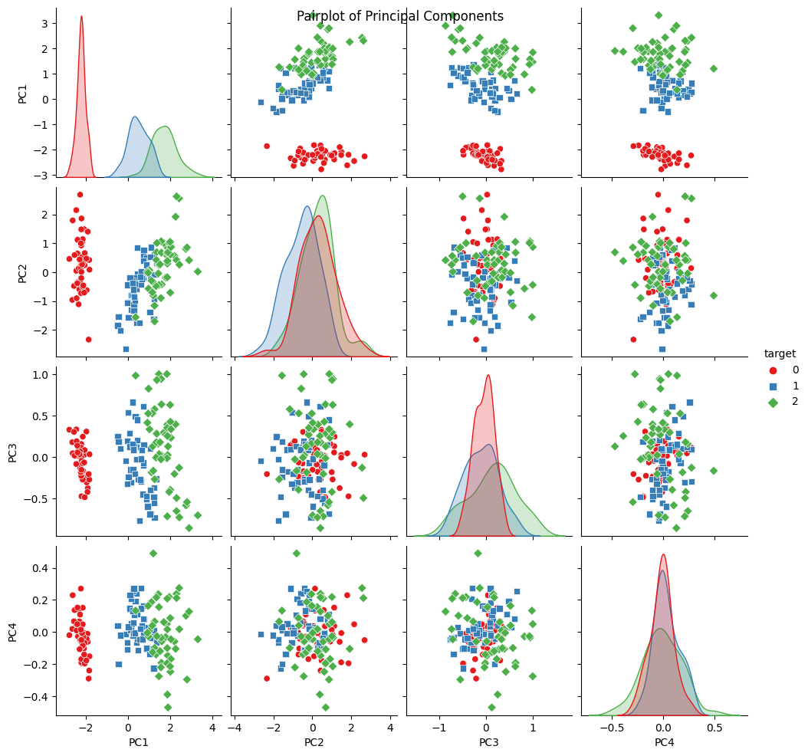

<div data-nosnippet style="background-color: #ffdddd; border-left: 5px solid #ff5555; padding: 10px; margin-bottom: 20px;">
  <strong>⚠️ Note :</strong> This page is based on lectures I attended at IMT Nord-Europe, more specifically the module "ODATA". This lecture was given by <strong>Christelle Garnier</strong>. I adapted some illustrations and examples, but the plan and the content are mainly from the lecture.
</div>


# PCA

> [!tldr] Summary
> Principal Component Analysis, by Karl Pearson, 1901. Formalised by Harold Hotelling.

## Introduction
### Objective

Principal Component Analysis (PCA) is a **dimension reduction** technique. It consists in transforming correlated variable into new un-correlated variable while keeping as much information as possible.
Given a set of data-points \\(\mathbf{X}\in \mathbb{R}^{(n,q)}\\), the main goal is to define an **orthogonal projection** on a subspace \\(E_{q}\\) of \\(\mathbb{R}^{p}\\) with dimension \\(q \lt p\\). In other words, we are looking to define \\(q\\) new variables, un-correlated, obtained through linear combination of the \\(p\\) initial variables, while losing as few information as possible. These variables are called **Principal Components**.

To achieve this, it is necessary to find a new vector basis of dimension \\(q\\) that distorts the point cloud as little as possible, i.e., one that preserves the dispersion (inertia) of the data as much as possible.

## The data
### Metric space of data points

We are interested in the proximity / similarity between data points. The metric used depends on the type of PCA used:

* **Canonical PCA**: We use $$\mathbf{M} = \mathbf{I}_{p} \iff \text{use the Euclidian distance } d_{M}^{2}(\mathbf{\tilde{x}}_{i}, \mathbf{\tilde{x}}_{l}) = d^{2}(\mathbf{\tilde{x}}_{i}, \mathbf{\tilde{x}}_{l}) = \sum_{j=1}^{p}(\tilde{x}_{i}^{j} - \tilde{x}_{l}^{j})^{2}$$. In that case we supposed the data are homogeneous and of the same magnitude.
* **Normed PCA**: We use $$\mathbf{M} = \mathbf{D}_{1/s^{2}}$$ which is equivalent to dividing each variable by its standard deviation: $$d_{M}^{2}= (\tilde{x}_{i}, \tilde{x}_{l}) = \sum_{j=1}^{p}\frac{(\tilde{x}_{i}^{j} - \tilde{x}_{l}^{j})^{2}}{s_{j}^{2}}$$.

Using the metric $$\mathbf{M} = \mathbf{D}_{1/s^{2}}$$ on the centered data $$\mathbf{\tilde{X}}$$ is equivalent to using the metric $$\mathbf{M} = \mathbf{I}_{p}$$ on the standardised data $$\mathbf{Z}$$, i.e. $$d_{M}^{2}(\tilde{\mathbf{x}}_{i}, \mathbf{\tilde{x}}_{l}) = d^{2}(\mathbf{z}_{i}, \mathbf{z}_{l})$$.

### Metric space of variables

To characterise the structure of the variables, we are interested in their proximity / similarity. We chose the metric $$\mathbf{M} = \mathbf{D}_{w}$$ which is positive semi-definite. By using this metric, we have:

* $$\langle \mathbf{\tilde{x}}^{j}, \mathbf{\tilde{x}}^{k} \rangle_{D_{w}} = \text{cov}(\mathbf{\tilde{x}}^{j}, \mathbf{\tilde{x}}^{k}) = s_{jk}$$
* $$\lVert \mathbf{\tilde{x}}^{j} \rVert_{D_{w}}^{2} = \langle \mathbf{\tilde{x}}^{j}, \mathbf{\tilde{x}}^{j}\rangle_{D_{w}} = \text{var}(\mathbf{\tilde{x}}^{j}) = s_{j}^{2}$$
* $$d_{D_{w}}^{2}(\mathbf{\tilde{x}}^{j}, \mathbf{\tilde{x}}^{k}) = \lVert \mathbf{\tilde{x}}^{j} - \mathbf{\tilde{x}}^{k} \rVert_{D_{w}}^{2} = \text{var}(\mathbf{\tilde{x}}^{j} - \mathbf{\tilde{x}}^{k})$$
* $$\cos \theta_{D_{w}}(\mathbf{\tilde{x}}^{j}, \mathbf{\tilde{x}}^{k}) = \frac{\langle \mathbf{\tilde{x}}^{j}, \mathbf{\tilde{x}}^{k} \rangle_{D_{w}}}{\lVert \mathbf{\tilde{x}}^{j}\rVert_{D_{w}} \lVert \mathbf{\tilde{x}}^{k}\rVert_{D_{w}}} = \frac{s_{jk}}{s_{j}s_{k}} = \text{cor}(\mathbf{\tilde{x}}^{j}, \mathbf{\tilde{x}}^{k}) = r_{jk}$$

### Inertia of the data point cloud

To characterise a cloud of points, we use the notion of **inertia**.

The inertia of a cloud of points is defined as the weighted mean of the squared distances between the points and the centre of gravity, formally:

$$
I = \sum_{i=1}^{n}w_{i}d_{M}^{2}(\mathbf{x}_{i}, \mathbf{g}) = \sum_{i=1}^{n}w_{i}\lVert \mathbf{x}_{i}- \mathbf{g}\rVert_{M}^{2} = \sum_{i=1}^{n}w_{i}\lVert \mathbf{\tilde{x}}_{i}\rVert_{M}^{2} = \sum_{i=1}^{n}w_{i}\mathbf{\tilde{x}}_{i}^{T}\mathbf{M}\mathbf{\tilde{x}}_{i}
$$

Or with matrices:

$$
I = \text{trace}(\mathbf{V}\mathbf{M}) = \text{trace}(\mathbf{M}\mathbf{V})
$$

It measures the dispersion of the points / how spread the points are around the centre of gravity.

The inertia of a cloud of points equals the inertia of a centred cloud.

In particular:
- In a canonical PCA, $$\mathbf{M}= \mathbf{I}_{p}$$, then $$I = \text{trace}(\mathbf{V}) = \sum_{j=1}^{p}s_{j}^{2}$$
- In a normed PCA, $$\mathbf{M} = \mathbf{D}_{1/s^{2}}$$, then $$I = \text{trace}(\mathbf{V}\mathbf{D}_{1/s^{2}}) = \text{trace}(\mathbf{D}_{1/s}\mathbf{V}\mathbf{D}_{1/s}) = \text{trace}(\mathbf{R}) = p$$

### Inertia of the Projected Data Point Cloud

The goal of [[PCA]] is to project the data point cloud on a linear sub-space of $$\mathbb{R}^{p}$$, so we are interested in the inertia after this projection.

**Inertia on the linear subspace**: The inertia of a data point cloud explained by a linear subspace $F$ of $$\mathbb{R}^{p}$$ is the inertia of the cloud projected onto $$F$$:

$$
I_{F} = \sum_{i=1}^{n} p_{i} \lVert P_{F}(\mathbf{\tilde{x}}_{i}) \rVert_{M}^{2} = \sum_{i=1}^{n} p_{i} P_{F}(\mathbf{\tilde{x}}_{i})^{T} \mathbf{M} P_{F}(\mathbf{\tilde{x}}_{i})
$$

where $$P_{F}(\mathbf{\tilde{x}})$$ is the orthogonal projection of $$\mathbf{\tilde{x}}_{i}$$ onto $$F$$. 

Inertia has some properties:

**Decomposition**

Let $$F$$ be a linear subspace of $$\mathbb{R}^{p}$$ and $$F^{\perp}$$ its $$\mathbf{M}$$-orthogonal supplementary space. The total inertia of a data point cloud of $$\mathbb{R}^{p}$$ can be decomposed as:

$$
I = I_{F} + I_{F_{\perp}}
$$

where $$I_{F}$$ is the inertia of the projected cloud, and $$I_{F^{\perp}}$$ is a measure of the distortion of the cloud when projecting onto $$F$$ (i.e., the inertia lost during the projection).

More generally, if $$F = F_{1} \oplus F_{2}$$ with $$F_{1} \perp F_{2}$$, then the inertia carried by $$F$$ is:

$$
I_{F} = I_{F_1} + I_{F_2}
$$

---

## The Principal Components Analysis Method

### Problem Formulation

PCA problem formulation: We are looking for a linear sub-space $$E_{k}$$ of $$\mathbb{R}^{p}$$ of dimension $k \lt p$ such that the inertia of the cloud projected onto $$E_k$$ is maximized:

$$
E_{k} = \arg \max_{\substack{E, \dim(E) = k}} I_{E}
$$

$$E_{k}$$ is called the **principal linear sub-space** of dimension $$k$$.

#### Theorem

Let $$E_{k-1}$$ be a linear sub-space of $$\mathbb{R}^{p}$$ with dimension $k-1 \lt p$ carrying the maximum inertia of the data cloud. Then, a linear sub-space of dimension $k$, $E_{k}$ can be obtained by:

$$
E_{k} = E_{k-1} \oplus \mathbf{\Delta}_{u_{k}}
$$

where $$\mathbf{\Delta}_{u_{k}}$$ is the $$\mathbf{M}$$-orthogonal line to $$E_{k-1}$$, spanned by the vector $$u_{k}$$ which carries the maximal energy.

**Consequence**: The principal linear sub-spaces, solution to the PCA problem, can be obtained in an iterative way.


### Solution of the Problem

The procedure to build the principal linear sub-spaces is as follows:
1. $$E_{1} = \mathbf{\Delta}_{u_{1}}$$ where $$\mathbf{\Delta}_{u_{1}}$$ is the line maximising the inertia explained by $$I_{\Delta_{u_{1}}}$$
2. $$E_{2} = E_{1} + \mathbf{\Delta}_{u_{2}}$$ where $$\mathbf{\Delta}_{u_{2}}$$ is the $$\mathbf{M}$$-orthogonal line to $$E_{1}$$ which maximises the explained inertia $$I_{u_{2}}$$
3. $$\dots$$
4. $$E_{k} = E_{k-1} \oplus \mathbf{u}_{k}$$ where $$\mathbf{u}_{k}$$ is the $$\mathbf{M}$$-orthogonal direction to $$E_{k-1}$$ that maximises the explained inertia $$I_{u_{k}}$$

**Principal vectors and axes**

The vectors $$u_{1}, u_{2}, \dots, u_{k}$$ are called the **principal vectors** of the [[PCA]] and the lines they span, $$\mathbf{\Delta}_{u_{1}}, \mathbf{\Delta}_{u_{2}}, \dots, \mathbf{\Delta}_{u_{k}}$$ are called **principal axis** of the [[PCA]]. 

So now the question is how to obtain these vectors?

### Computation of the Principal Vectors

#### Computation of $$\mathbf{u}_{1}$$

Recall, let $$\mathbf{u}$$ be a $$\mathbf{M}$$-normed vector of $$\mathbb{R}^{p}$$ ($$\lVert \mathbf{u} \rVert_{\mathbf{M}} = 1$$), the inertia explained by the line $$\mathbf{\Delta}_u$$ spanned by $$\mathbf{u}$$ is:

$$
I_{\Delta_{u}} = \mathbf{u}^{T}\mathbf{M}\mathbf{V}\mathbf{M}\mathbf{u}
$$

We are thus looking for the vector $$\mathbf{u}_{1}$$, $$\mathbf{M}$$-normed, such that the projected cloud has the maximal inertia:

$$
\mathbf{u}_{1} = \arg \underset{\mathbf{u} \in \mathbb{R}^{p}, \lVert \mathbf{u} \rVert_{\mathbf{M}} = 1}{\max} I_{\Delta_{u}} = \arg \underset{\mathbf{u} \in \mathbb{R}^{p}, \lVert \mathbf{u} \rVert_{\mathbf{M}} = 1}{\max} \mathbf{u}^{T} \mathbf{M} \mathbf{V} \mathbf{M} \mathbf{u}
$$

**Constrained Optimisation Problem** ($$\lVert \mathbf{u} \rVert_{\mathbf{M}} = \mathbf{u}^{T} \mathbf{M} \mathbf{u} = 1$$)

We transform it as an unconstrained optimisation problem by introducing a Lagrange multiplier:

$$
(\mathbf{u}_{1}, \lambda_{1}) = \arg \underset{u \in \mathbb{R}^{p}, \lambda \in \mathbb{R}}{\max} u^{T} \mathbf{M} \mathbf{V} \mathbf{M} \mathbf{u} - \lambda (u^{T} \mathbf{M} \mathbf{u} - 1)
$$

The solution of the optimisation problem nullifies the partial derivatives:

$$
\begin{aligned}
\frac{\partial u^{T} \mathbf{M} \mathbf{V} \mathbf{M} u - \lambda (u^{T} \mathbf{M} u - 1)}{\partial u} &= 2(\mathbf{MVM} u - \lambda \mathbf{M} u) = 0 \\
\frac{\partial u^{T} \mathbf{M} \mathbf{V} \mathbf{M} u - \lambda (u^{T} \mathbf{M} u - 1)}{\partial \lambda} &= u^{T} \mathbf{M} u - 1 = 0
\end{aligned}
$$

$$u_{1}$$ and $$\lambda_{1}$$ satisfy $$\mathbf{VM} u_{1} = \lambda_{1} u_{1}$$ and $$u_{1}^{T} \mathbf{M} u_{1} - 1 = 1$$.

So, $$u_1$$ is **the eigenvector**, $$\mathbf{M}$$-normed, of the matrix $$\mathbf{VM}$$ associated with the eigenvalue $$\lambda_{1}$$.

The inertia is then:

$$
I_{\Delta_{\mathbf{u}_{1}}} = \mathbf{u}_{1}^{T} \mathbf{M} \mathbf{VM} \mathbf{u}_{1} = \lambda \mathbf{u}_{1}^{T} \mathbf{M} \mathbf{u}_{1} = \lambda_{1}
$$

**To maximise inertia, the first principal vector should be chosen as the eigenvector $$u_{1}$$ associated with the largest eigenvalue $$\lambda_{1}$$ of the matrix $$\mathbf{VM}$$.**

- ***Eigenvectors** correspond to privileged **directions** of the matrix.*
- ***Eigenvalues** represent the **scaling factors** (stretching or compression) along these directions.*

#### Computation of \\(u_{k}\\)

Similar procedure. Suppose we know the $$k-1$$ first principal vectors $$u_{1}, u_{2}, \dots, u_{k-1}$$. We are looking for the vector $$u_{k}$$, $$\mathbf{M}$$-normed, $$\mathbf{M}$$-orthogonal to $$u_{1}, u_{2}, \dots, u_{k-1}$$ such that the projected cloud has the maximal inertia.

By applying the method of the Lagrange multiplier with the added orthogonality constraints, we have:

The $$k$$-th principal vector $$u_{k}$$ is the eigenvector associated with the $$k$$-th largest eigenvalue $$\lambda_{k}$$ of the matrix $$\mathbf{VM}$$.

The inertia explained by the $$k$$-th principal axis $$\Delta_{u_{k}}$$ (spanned by $$u_{k}$$) is given by:

$$
I_{\Delta_{u_{k}}} = \lambda_{k}
$$

Thus,

#### Theorem

For all $$k \leq p$$, the space $$E_{k}$$ of dimension $$k$$, which carries the **maximal inertia** of the point cloud, is spanned by the **first $$k$$ eigenvectors** $$u_{1}, u_{2}, \dots, u_{k}$$ associated with the $$k$$-th largest eigenvalue of the matrix $$\mathbf{VM}$$: $$\lambda_{1}, \lambda_{2}, \dots, \lambda_{k}$$ (ordered from the smallest to the largest). 

The inertia explained by $$E_{k} = \mathbf{\Delta}_{u_{1}} \oplus \mathbf{\Delta}_{u_{2}} \oplus \dots \oplus \mathbf{\Delta}_{u_{k}}$$ is:

$$
I_{E_{k}} = I_{\mathbf{\Delta}_{u_{1}}} + I_{\mathbf{\Delta}_{u_{2}}} + \dots + I_{\mathbf{\Delta}_{u_{k}}} = \lambda_{1} + \lambda_{2} + \dots + \lambda_{k}
$$

Remarks:
- \\(I_{E_{p}} = \sum_{j=1}^{p} \lambda_{j} = \text{trace}(\mathbf{VM})\\)
- The matrix $$\mathbf{VM}$$ is $$\mathbf{M}$$-symmetric positive semi-definite. Consequently, all the eigenvalues $$\lambda_{1}, \lambda_{2}, \dots, \lambda_{k}$$ are real and positive, and the eigenvectors $$\mathbf{u}_{1}, \mathbf{u}_{2}, \dots, \mathbf{u}_{k}$$ forms a \\(\mathbf{M}\\)-orthonormal basis of $$E_{p}$$.

### Projection of the Data Point Cloud and Principal Components

To represent the data point cloud in the bases of the principal vectors $$\mathbf{u}_{1}, \mathbf{u}_{2}, \dots, \mathbf{u}_{k}$$ of \\(\mathbb{R}^{p}\\), we compute the coordinates, called **principal components**, of the data point cloud projected onto each principal axis. The coordinates \\(c_{i}^{j}\\) of the data point $$\mathbf{\tilde{x}}_{i}$$ on the principal axis $$\mathbf{\Delta}_{\mathbf{u}_{j}}$$ are given by:

$$
c_{i}^{j} = \langle \mathbf{\tilde{x}}_{i}, \mathbf{u}_{j} \rangle_{\mathbf{M}} = \mathbf{\tilde{x}}_{i}^{T} \mathbf{M} \mathbf{u}_{j}
$$

The vector $$\mathbf{c}^{j} \in \mathbb{R}^{n}$$, which contains the coordinates of the $$n$$ data points along the axis $$\mathbf{\Delta}_{\mathbf{u}_{j}}$$, is called the $$j$$-th principal component:

$$
\mathbf{c}^{j} = \left[ c_{1}^{j} \quad c_{2}^{j} \quad \dots \quad c_{n}^{j} \right]^T = \mathbf{Y M u_{j}}
$$

The decomposition of data point $$i$$ in the basis of the principal vectors $$(\mathbf{u}_{1}, \mathbf{u}_{2}, \dots, \mathbf{u}_{p})$$ of $$\mathbb{R}^{p}$$ is given by:

$$
\mathbf{\tilde{x}}_{i} = \sum_{j=1}^{p} \langle \mathbf{\tilde{x}}_{i}, \mathbf{u}_{j} \rangle_{\mathbf{M}} \mathbf{u}_{j} = \sum_{j=1}^{p} c_{i}^{j} \mathbf{u}_{j}
$$

The projection of data point $$i$$ into the principal subspace $$E_{q}$$ spanned by $$q$$ $$(q < p)$$ principal vectors $$(\mathbf{u}_{1}, \mathbf{u}_{2}, \dots, \mathbf{u}_{q})$$ is given by:

$$
P_{E_{q}} (\mathbf{\tilde{x}}_{i}) = \sum_{j=1}^{q} \langle \mathbf{\tilde{x}}_{i}, \mathbf{u}_{j} \rangle_{\mathbf{M}} \mathbf{u}_{j} = \sum_{j=1}^{q} c_{i}^{j} \mathbf{u}_{j}
$$

#### Properties of Principal Components

- The $$\mathbf{c}^{j} = \mathbf{Y M u_{j}}$$ are linear combinations of the original variables $$\mathbf{\tilde{x}}^{j}$$.
  - The principal components can be interpreted as new variables associated with the data points.
- The $$\mathbf{c}^{j}$$ are centered, with variance $$\lambda_{j}$$ and pairwise uncorrelated.
  - $$(\mathbf{c}^{1}, \mathbf{c}^{2}, \dots, \mathbf{c}^{p})$$ form a $$D_{w}$$-orthogonal system in the space of variables $$\mathbb{R}^{n}$$.

By defining the vector $$\mathbf{d}^{j} = \frac{\mathbf{c}^{j}}{\sqrt{\lambda_{j}}}$$, called the $$j$$-th principal factor, we obtain a $$D_{w}$$-orthonormal system in $$\mathbb{R}^{n}$$: $$(\mathbf{d}^{1}, \mathbf{d}^{2}, \dots, \mathbf{d}^{p})$$.

### Projection of the Variable Cloud

To represent the variable cloud in the linear sub-space $$F_{q}$$ spanned by $$q$$ principal factors $$\mathbf{d}^{1}, \mathbf{d}^{2}, \dots \mathbf{d}^{q}$$, $$q < p$$.

The coordinate of the variable $$\mathbf{\tilde{x}}^{j}$$ on the axis spanned by $$\mathbf{d}^{k}$$ is:

$$
\langle \mathbf{\tilde{x}}^{j}, \mathbf{d}^{k} \rangle_{\mathbf{D}_{w}} = \text{cov}(\mathbf{\tilde{x}}^{j}, \mathbf{d}^{k}) = \mathbf{\tilde{x}}^{j^{T}} \mathbf{D}_{w} \mathbf{d}^{k} = \mathbf{\tilde{x}}^{j^{T}} \mathbf{D}_{w} \frac{\mathbf{c}^{k}}{\sqrt{\lambda_{k}}}
$$

and $$\mathbf{c}^{k} = \mathbf{\tilde{X} M u_{k}}$$, so,

$$
\langle \mathbf{\tilde{x}}^{j}, \mathbf{d}^{k} \rangle_{\mathbf{D}_{w}} = \frac{1}{\sqrt{\lambda_{k}}} \mathbf{\tilde{x}}^{j^{T}} \mathbf{D}_{w} \mathbf{\tilde{X} M u}_{k}
$$

and $$\mathbf{\tilde{X}}^{T} \mathbf{D_{w} \tilde{X}} = \mathbf{V}$$, so $$\mathbf{\tilde{x}}^{j^{T}} \mathbf{D_{w} \tilde{X}} = \mathbf{V}_{j}$$, and

$$
\langle \mathbf{\tilde{x}}^{j}, \mathbf{d}^{k} \rangle_{\mathbf{D}_{w}} = \frac{1}{\sqrt{\lambda_{k}}} \mathbf{V}_{j} \mathbf{M} \mathbf{u}_{k}
$$

Thus,

#### Coordinates of the Variable $$\mathbf{\tilde{x}}^{j}$$ onto the Axis Spanned by $$\mathbf{d}^{k}$$

$$
\langle \mathbf{\tilde{x}}^{j}, \mathbf{d}^{k} \rangle_{D_{w}} = \text{cov}(\mathbf{\tilde{x}}^{j}, \mathbf{d}^{k}) = \sqrt{\lambda_{k} u_{k}^{j}}
$$

### Summary of PCA Method:

**Inputs:**
- $$\mathbf{\tilde{X}}$$ or $$\mathbf{Z}$$: matrix $$(n, p)$$ of the centered or standardized data
- $$\mathbf{D}_{w}$$: matrix  $$(n, n)$$ of the weights of each data point (which defines a metric on the space of variables)
- $$\mathbf{M}$$: matrix $$(p, p)$$ which defines a metric on the space of data points.

**Outputs:**
- $$\lambda_{1}, \lambda_{2}, \dots, \lambda_{p}$$: eigenvalues of the matrix $$\mathbf{V M} = \mathbf{Y}^{T} \mathbf{D}_{w} \mathbf{Y M}$$, ordered by descending order, they are real and positive.
- $$\mathbf{u}_{1}, \mathbf{u}_{2}, \dots, \mathbf{u}_{p}$$: the principal vectors, which are in fact the eigenvectors associated with the matrix $$\mathbf{M}$$, and which form a $$\mathbf{M}$$-orthonormal basis of $$\mathbb{R}^{p}$$.
- $$\mathbf{c}^{1}, \mathbf{c}^{2}, \dots, \mathbf{c}^{p}$$: the principal components given by $$\mathbf{c}^{j} = \mathbf{Y M u}_{j}$$.

## Representation and interpretation

### Representation of the data points

The objective of [[PCA]] is dimension reduction, we want to keep as few axis as possible. So, how to chose how many to keep?
There is no consensus but several criteria exist in the literature:
- **Explained variance**: The number of components $$q$$ is chosen such that they account for a predefined proportion or percentage of the total variance, given by $$I=\sum_{j=1}^{p}\lambda_{j}$$. These method ensures that the selected components provide a sufficient global representation of the data
- **Kaiser's rule**: Only components associated with eigenvalues greater than the average eigenvalue $$\frac{I}{p}$$​ are retained, as these are considered the most "informative." In the case of standardized PCA, this average eigenvalue equals 1.
- **Elbow criterion**: involves plotting the eigenvalues $$\lambda_j$$​ in decreasing order as a function of their index $$j$$. The goal is to identify an "elbow" in the curve, which represents the point where the eigenvalues exhibit a sharp decline before stabilizing.

For a plot, we chose $$q=2$$ or $$q=3$$.

#### Global Quality of Representation on a Principal Axis

The **global quality of representation** of the data cloud on a principal axis $$\mathbf{u}_{j}$$​ is measured by the percentage of total variance (or inertia) explained by that axis. This is given by:
$$
\frac{I_{\Delta_{u_{j}}}}{I} = \frac{\lambda_{j}}{\sum_{j=1}^{p}\lambda_{j}}
$$

The closer the quality of representation to **1 (or 100%)**, the more the original data cloud (before projection) is concentrated around the principal axis. This implies that the projection of the data onto this axis provides a **faithful** and **informative** representation of the original structure.

#### Global Quality of Representation on a Principal Subspace

The **global quality of representation** of the data cloud on the principal subspace $$E_{q}$$ spanned by the first $$q$$ principal components $$\mathbf{u}_{1}, \mathbf{u}_{2}, \dots, \mathbf{u}_{q}$$ is measured by the proportion of total variance (or inertia) explained by this subspace:
$$
\frac{I_{E_{q}}}{I} = \frac{\lambda_{1} + \lambda_{2} + \dots + \lambda_{q}}{\sum_{j=1}^{p}\lambda_{j}}
$$
This measure, expressed as a percentage, indicates how well the reduced-dimensional subspace $$E_{q}$$ preserves the structure of the original data cloud.

#### Quality of Representation of a data point on a Principal Axis

The **quality of the representation of a data point $$i$$** on a principal axis $$\mathbf{u}_{j}$$ is measured by the **squared cosine** of the angle between the data point's position in the transformed space and its projection onto the axis:
$$
\cos^{2} \theta_{\mathbf{M}}\left(\mathbf{\tilde{x}}_{i}, P_{\mathbf{\Delta_{u_{j}}}}(\mathbf{\tilde{x}}_{i}) \right) = \frac{\lVert P_{\mathbf{\Delta}_{u_{j}}}(\mathbf{\tilde{x}}_{i})\lVert_{\mathbf{M}}^{2}}{\lVert \mathbf{\tilde{x}}_{i}^{2}\lVert_{\mathbf{M}}^{2}} = 
\frac{\lVert c_{i}^{j}\mathbf{u}_{j}\lVert_{\mathbf{M}}^{2}}{\lVert \sum_{j=1}^{p} c_{i}^{j} \mathbf{u}_{j} \lVert_{\mathbf{M}}^{2}}
= \frac{(c_{i}^{j})^{2}}{\sum_{j=1}^{p}(c_{i}^{j})^{2}}
$$

#### Quality of Representation of a data point on a Principal Subspace

The **quality of the representation of a data point** $$i$$ on the principal subspace $$E_{q}$$ spanned by the first $$q$$ principal components, is measured by the squared cosine of the angle between the data point's position vector $$\mathbf{\tilde{x}}_{i}$$ and its projection $$P_{E_{q}}$$ onto the subspace $$E_{q}$$:
$$
\cos^{2\theta_{\mathbf{M}}(\mathbf{\tilde{x}}, P_{E_{q}}(\mathbf{\tilde{x}}_{i}))}= \frac{\lVert P_{\mathbf{E}_{q}}(\mathbf{\tilde{x}}_{i})\lVert_{\mathbf{M}}^{2}}{\lVert \mathbf{\tilde{x}}_{i}^{2}\lVert_{\mathbf{M}}^{2}} =
\frac{\lVert \sum_{j=1}^{q} c_{i}^{j} \mathbf{u}_{j} \lVert_{\mathbf{M}}^{2}}{\lVert \sum_{j=1}^{p} c_{i}^{j} \mathbf{u}_{j} \lVert_{\mathbf{M}}^{2}}
= \frac{\sum_{j=1}^{q}(c_{i}^{j})^{2}}{\sum_{j=1}^{p}(c_{i}^{j})^{2}}
$$

- If the cosinus value is close to 1, the data point is weel represented by the subspace, meaning its projection retains most of its variance
- If the cosinus value is low, the data point is poorly represented in the subspace

In practice, a value above $$0.8$$ is considered good and one below $$0.5$$ means a poor representation.
**CAUTION** the value of the cosinus is not relevant for data point **near the origin**

#### Data point's contribution to a Principal Axis
The **contribution of an data point**  $$i$$ to the inertia carried by a principal axis $$\mathbf{\Delta}_{\mathbf{u}_{j}}$$ is measured by the ratio:
$$
\frac{w_{i}(c_{i}^{j})^{2}}{I_{\mathbf{\Delta}_{\mathbf{u}_{j}}}}=\frac{w_{i}(c_{i}^{j})^{2}}{\lambda_j}
$$
Indeed, $$I_{\mathbf{\Delta}_{\mathbf{u}_{j}}} = \lambda_{j}= \text{var}(\mathbf{c}^{j}) = \sum_{i=1}^{n}w_{i}(c_{i}^{j})^{2}$$. It is useful to detect data point which contributes too much to the axis as they are causes for instability.  

We consider a data point's contribution to a principal component axis as too strong if it exceeds the data point's weight by a factor of $$\alpha$$ the weight $$w_{i}$$ of the data point:
$$
\frac{w_{i}(c_{i}^{j})^{2}}{\lambda_{j}} \geq \alpha w_{i} \iff \frac{(c_{i}^{j})^{2}}{\lambda_{j}}=(d_{i}^{j})^{2} \geq \alpha
$$
The value of $$\alpha$$ is chosen between 2 and 4 depending on the data. Once detected, these data point can be:
	-**Excluded** for the computation of the PCA
	- **Reintegrated** as additional data points, by adding them to the representation on the principal axes.

#### Describing a data point Map

- Report the percentage of inertia explained by each axis and by the considered plane
- Assess the quality of representation of data points. Identify poorly represented data points in this plane and remove them from the analysis
- Analyse the contributions of data points. Identify those with excessive contributions. Check for possible errors and consider treating them as supplementary data points.
- Study proximities and oppositions between points in terms of behavior. Identify groups of data points and specific patterns. Verify observed trends based on the original data.

### Representation of Variables (or Correlation Circle)


The best $$q$$-dimensional representation ($$q \lt p$$) of the cloud of variables, in term of inertia, is obtained by projecting onto the factorial subspace $$F_{q}$$ spanned by the first $$q$$ principal factors $$\mathbf{d}^{1}, \mathbf{d}^{2}, \dots ,\mathbf{d}^{q}$$.
The coordinates of the variable $$\mathbf{\tilde{x}}^{j}$$ on each principal factor $$\mathbf{d}^{k}$$ are: $$\langle \mathbf{\tilde{x}}^{j}, \mathbf{d}^{k} \rangle_{D_{w}} = \text{cov}(\mathbf{\tilde{y}}^{j}, \mathbf{d}^{k}) = \sqrt{\lambda_{k}u_{k}^{j}},k=1,\dots,q$$. The projection of the variable $$j$$ onto $$F_{q}$$ is $$P_{F_{q}} = \sum_{k=1}^{q}\text{cov}(\mathbf{\tilde{x}}^{j},\mathbf{d}^{k})\mathbf{d}^{k}=\sum_{k=1}^{q}\sqrt{\lambda_{k}}u_{k}^{j}\mathbf{d}^{k}$$

#### Global quality of representation on a Factorial Axis

The overall quality of the representation of the data cloud on a factorial axis $$\mathbf{\Delta}_{d^k}$$ is measured by the percentage of inertia explained by this axis:$$
\frac{I_{\mathbf{\Delta}_{d^{k}}}}{I} = \frac{\lambda_{k}}{\sum_{j=1}^{p}\lambda_{j}}
$$
The closer this quality measure is to **1**, the more the original cloud (before projection) is concentrated around the axis, and the less its projected image is distorted.

#### Global Quality of the Representation of the Data Cloud on a Factorial Subspace

The overall quality of the representation of the data cloud on the factorial subspace $$F_{q}$$ generated by the first $q$ principal factors $$\mathbf{d}^{1},\mathbf{d}^{2}, \dots, \mathbf{d}^{q}$$ is measured by the proportion of inertia explained by $$F_{q}$$:
$$
\frac{I_{F_{q}}}{I} = \frac{\lambda_{1} + \lambda_{2} + \dots + \lambda_{q}}{\sum_{j=1}^{p}\lambda_{j}}
$$

#### Quality of the Representation of a Variable on a Factorial Axis

The quality of the representation of a variable $j$ on a factorial axis $$\mathbf{\Delta}_{d^{k}}$$ is measured by the squared cosine of the angle between $$\mathbf{\tilde{x}}^{j}$$​ and its projection onto this axis:
$$
\cos^{2}\theta_{D_{w}}(\mathbf{\tilde{x}}^{j},P_{\mathbf{\Delta}_{d^{k}}}(\mathbf{\tilde{x}}^{j})) = \frac{\lVert P_{\mathbf{\Delta}_{d^{k}}}(\mathbf{\tilde{x}}^{j})\lVert_{D_{w}}^{2}}{\lVert \mathbf{\tilde{x}}^{j}\lVert_{D_{w}}^{2}} = \frac{\lVert \text{cov}(\mathbf{\tilde{x}}^{j}, \mathbf{d}^{k}) \mathbf{d}^{k} \lVert_{D_{w}}^{2}}{\text{var}(\mathbf{\tilde{x}}^{j})^{2}}
= \frac{(\text{cov}(\mathbf{\tilde{x}}^{j}, \mathbf{d}^{k}))^{2}}{\text{var}(\mathbf{\tilde{x}}^{j})^{2}}=
(\text{cor}(\mathbf{\tilde{x}}^{j}, \mathbf{d}^{k})^{2})
$$

#### Quality of the Representation of a Variable on a Factorial Subspace

The quality of the representation of a variable $j$ on the factorial subspace $$F_{q}$$​ is measured by the squared cosine of the angle between the vector $$\mathbf{\tilde{x}}^{j}$$ ​and its projection $$P_{F_{q}}(\mathbf{\tilde{x}}^{j})$$ onto $$F_{q}$$:$$
cos \theta^2_{D_p} \left( \tilde{\mathbf{x}}^j, P_{F_q} (\tilde{\mathbf{x}}^j) \right) = \frac{\| P_{F_q} (\tilde{\mathbf{x}}^j) \|^2_{D_p}}{\| \tilde{\mathbf{x}}^j \|^2_{D_p}} = \frac{\| \sum_{k=1}^{q} \mathrm{cov}(\tilde{\mathbf{x}}^j, \mathbf{d}^k) \mathbf{d}^k \|^2_{D_p}}{\mathrm{var}(\tilde{\mathbf{x}}^j)^2}
= \frac{\sum_{k=1}^{q} \left( \mathrm{cov}(\tilde{\mathbf{x}}^j, \mathbf{d}^k) \right)^2}{\mathrm{var}(\tilde{\mathbf{x}}^j)^2} = \sum_{k=1}^{q} \left( \mathrm{cor}(\tilde{\mathbf{x}}^j, \mathbf{d}^k) \right)^2
$$

- If the squared cosine is close to 1, the variable $$j$$ is well represented on $$F_{q}$$
- If it is close to 0, the variable $$j$$$ is poorly represented on $$F_{q}$$
Only well represented variable into the considered sub-space can be interpreted. 

#### Correlation Circle

In the case of a normed PCA, consider the matrix of standardised data $$\mathbf{Z}$$. Then, 

- $$\lVert \mathbf{z}^{j} \lVert_{D_{w}}^{2} = \text{var}(\mathbf{z}^{j})=1$$
- $$\langle \mathbf{z}^{j}, \mathbf{d}^{k} \rangle_{D_{w}}=\text{cov}(\mathbf{z}^{j}, \mathbf{d}^{k})=\text{cor}(\mathbf{z}^{j}, \mathbf{d}^{k})$$

Since $$\lVert \mathbf{z}^{j} \lVert_{D_{w}}^{2} = 1$$, all the variable are on the unit sphere in the space of variable.
The intersection between the unit sphere and a factorial plan is a unit circle, called **correlation circle**.
The projection of a variable $$\mathbf{z}^{j}$$ onto a factorial plan is in the circle of correlation.

**CONSEQUENCE**: A variable $$j$$ is well represented on a factorial plan if its orthogonal projection on the plan is close to the correlation circle. 

#### How to Describe a Variable Map or a Correlation Circle in PCA?

- Compute the percentage of inertia (variance) explained by each axis
- Precise the quality of the representation of variables. Detect the poorly represented variable on this plan and remove them from the analysis.
- Compute the correlation of between variables and axis to interpret the new axis function of the initial variables
- Study the covariances, or correlation for a normed PCA, between variables. Detect group of variable. Verify observed trends based on the correlation matrix.

## In practice

In practice, to use Principal Component Analysis (PCA) on a dataset, you can use the `PCA` class from the `sklearn.decomposition` module. The first step is to standardize the data using `StandardScaler` from the `sklearn.preprocessing` module, since PCA is sensitive to the scale of the features.

Here is an example demonstrating the process on the Iris dataset:

```python
import numpy as np
import pandas as pd
import matplotlib.pyplot as plt
import seaborn as sns
from sklearn.decomposition import PCA
from sklearn.datasets import load_iris

# Load the Iris dataset
iris = load_iris()
X = iris.data
y = iris.target
feature_names = iris.feature_names

# Standardize the data
Z = (X - X.mean(axis=0)) / X.std(axis=0)

# Perform PCA
pca = PCA(n_components=4)
principal_components = pca.fit_transform(Z)

# Create a DataFrame with the principal components
pca_df = pd.DataFrame(data=principal_components, columns=['PC1', 'PC2', 'PC3', 'PC4'])
pca_df['target'] = y

# Explained variance
explained_variance = pca.explained_variance_ratio_

# Plot explained variance
plt.figure(figsize=(8, 5))
plt.bar(range(1, 5), explained_variance, alpha=0.5, align='center', label='individual explained variance')
plt.step(range(1, 5), np.cumsum(explained_variance), where='mid', label='cumulative explained variance')
plt.ylabel('Explained variance ratio')
plt.xlabel('Principal components')
plt.legend(loc='best')
plt.title('Explained Variance by Principal Components')
plt.show()

# Scree plot (Elbow plot)
plt.figure(figsize=(8, 5))
plt.plot(range(1, 5), pca.explained_variance_, marker='o', linestyle='--')
plt.xlabel('Principal Component')
plt.ylabel('Eigenvalue')
plt.title('Scree Plot (Elbow Plot)')
plt.show()

# Kaiser's rule plot
plt.figure(figsize=(8, 5))
plt.plot(range(1, 5), pca.explained_variance_, marker='o', linestyle='--', label='Eigenvalues')
plt.axhline(y=1, color='r', linestyle='-', label='Kaiser\'s Criterion')
plt.xlabel('Principal Component')
plt.ylabel('Eigenvalue')
plt.title('Kaiser\'s Rule Plot')
plt.legend()
plt.show()

# Pairplot of the first three principal components
sns.pairplot(pca_df, hue='target', markers=["o", "s", "D"], palette='Set1')
plt.suptitle('Pairplot of Principal Components')
plt.show()

# 2D scatter plot of the first two principal components
plt.figure(figsize=(8, 5))
sns.scatterplot(x='PC1', y='PC2', hue='target', data=pca_df, palette='Set1', s=100)
plt.title('2D Scatter Plot of Principal Components 1 and 2')
plt.xlabel('Principal Component 1')
plt.ylabel('Principal Component 2')
plt.legend(loc='best')
plt.show()

# 2D scatter plot of the third and fourth principal components
plt.figure(figsize=(8, 5))
sns.scatterplot(x='PC3', y='PC4', hue='target', data=pca_df, palette='Set1', s=100)
plt.title('2D Scatter Plot of Principal Components 3 and 4')
plt.xlabel('Principal Component 3')
plt.ylabel('Principal Component 4')
plt.legend(loc='best')
plt.show()

# 3D scatter plot of the first three principal components
from mpl_toolkits.mplot3d import Axes3D

fig = plt.figure(figsize=(10, 7))
ax = fig.add_subplot(111, projection='3d')
scatter = ax.scatter(pca_df['PC1'], pca_df['PC2'], pca_df['PC3'], c=y, cmap='Set1', s=100)
legend1 = ax.legend(*scatter.legend_elements(), title="Classes")
ax.add_artist(legend1)
ax.set_title('3D Scatter Plot of Principal Components')
ax.set_xlabel('Principal Component 1')
ax.set_ylabel('Principal Component 2')
ax.set_zlabel('Principal Component 3')
plt.show()

# Correlation circle for the first two principal components
def plot_correlation_circle(pca, feature_names, pc1, pc2):
    pcs = pca.components_
    plt.figure(figsize=(8, 8))
    plt.quiver(np.zeros(pcs.shape[1]), np.zeros(pcs.shape[1]), pcs[pc1-1, :], pcs[pc2-1, :], angles='xy', scale_units='xy', scale=1)
    for i, feature in enumerate(feature_names):
        plt.text(pcs[pc1-1, i], pcs[pc2-1, i], feature, fontsize=12)
    # Plots the unit circle
    circle = plt.Circle((0, 0), 1, color='b', fill=False)
    plt.xlim(-1, 1)
    plt.ylim(-1, 1)
    plt.xlabel(f'Principal Component {pc1}')
    plt.ylabel(f'Principal Component {pc2}')
    plt.title(f'Correlation Circle (PC{pc1} vs PC{pc2})')
    plt.grid()
    plt.axhline(0, color='grey', lw=1)
    plt.axvline(0, color='grey', lw=1)
    plt.show()

plot_correlation_circle(pca, feature_names, 1, 2)
plot_correlation_circle(pca, feature_names, 3, 4)
```

Here we can see the explained variance (inertia) kept by each principal component. In this specific example, the first principal component keep 70% of the explained variance already.


If we want to chose a number of principal axis to keep, we can use one of the following method:
Here are plots of the data on every possible maps.


More detailed here, the best map is the map $E_{1} \oplus E_{2}$. 


The projected data onto the two next principal axis:


The projected data onto the three best principal axis: 


The correlation circle for the two first factor axis (we can see the first factor is related to the petal, it is a mean between its width and length, and the other axis is related to the sepal width)


And for the two lasts:


