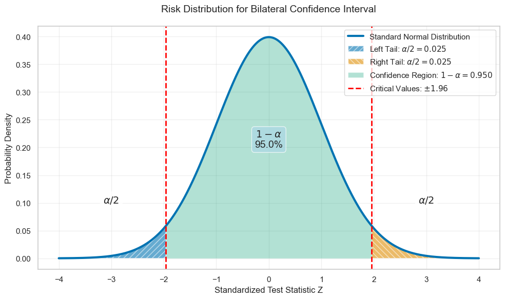
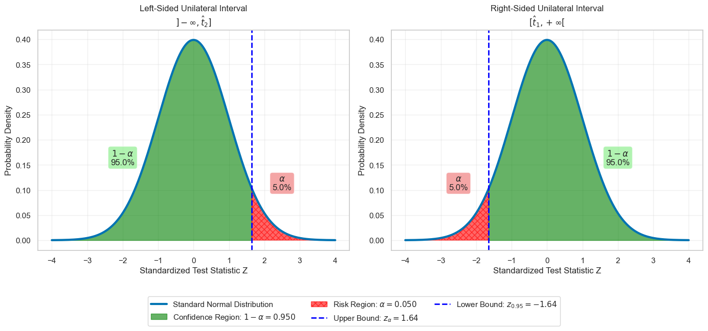
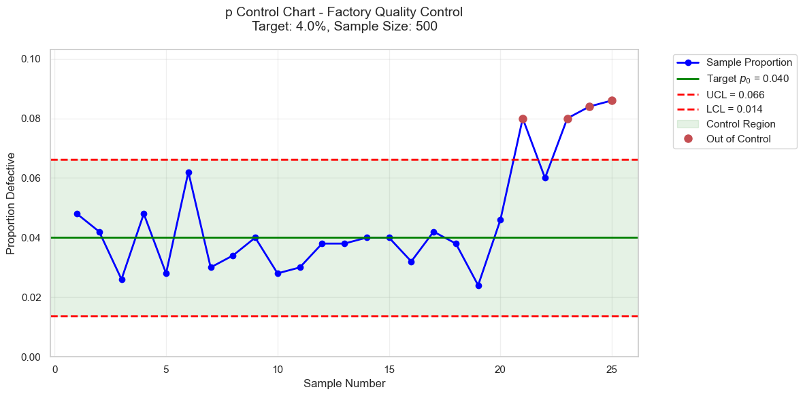

> [!tldr] Summary
> 101

> [!quote] Quote
> .

## Introduction

This page is about estimation. We first need to define what are populations, samples, and statistical inference. We then estimate the value of some unknown parameter. However, instead of just going all in on one estimated value, we usually prefer to bound the results within a high probability of success, using confidence intervals.


## Hypotheses, Characteristics of a Sample

### Population, Samples, Statistical Inference

The population is the set of individuals on which a statistical study is conducted. It is generally denoted by the letter $$\Omega$$. An individual belonging to the population $$\Omega$$ is written $$\omega \in \Omega$$.

In the case where the population $$\Omega$$ is finite, we can write
$$
\Omega = \{\omega_{1}, \omega_{2,}\ldots, \omega_{N}\}
$$
where $$N= \text{Card}\ \Omega$$ is the size of the population.

Suppose we are interested in a particular characteristic of individuals in the population, formalised by a variable $$X$$, which we call variable of interest.

In general, it is not possible de determine the values of $$X$$ for all individuals in the population. A survey is then conducted to obtain an estimate of the parameters characterising the population. A survey requires sampling from the population $$\Omega$$, defined as an $$n$$-tuple of elements on $$\Omega$$. Such a sample is often denoted by the letter $$S$$ (sample). We can write:
$$
S = \{ \omega_{1}, \omega_{2}, \ldots, \omega_{n}\}
$$
Generally the sample size is denote $$n$$.

< How to select a "good" sample from the population? >

There are different sampling procedures, also called survey methods. We distinguish two main families:

- Random or probabilistic methods, based on the random selection of individuals within the population.
- Empirical or non-random methods.

The quota method, widely used by polling institutes, is the best-known empirical method. It consists of constructing a sample as a scaled-down model of the studied population according to certain criteria: region, gender, age, socio-professional category, etc.

In statistics, random survey methods are preferred, which, unlike empirical methods, allow us to rigorously quantify the estimates made and determine the errors committed.

Among the random methods, the most well-known is simple random sampling, sometimes denoted as SRSWOR (for "Simple Random Sampling Without Replacement"), which consists of randomly and without replacement selecting $$n$$ individuals from the population of size $$N$$. Each individual in the population has the same probability as the others of being selected. This probability is equal to $$\tau = \frac{n}{N}$$​ and is called the sampling rate. As a result, all samples of size $$n$$ have the same probability of being selected.

Once the sample is drawn, we want to extend the properties observed on it to the entire population. This is what we call statistical inference. Characteristics of the sample such as its mean, variance, or a proportion can be extended to the entire population using estimation methods. 

### Hypotheses of Classical Statistics

The key concept in statistics is variability, which means that characteristics can take different values: thus, an industrial process never provides perfectly constant characteristics. In statistics, observed data is modeled using random variables. Probability theory then plays a fundamental role, both in modeling certain random phenomena and in studying the characteristics observed in the sample.
#### Hypotheses of classical statistics

- The observed values $$(x_{1}, x_{2}, \ldots ,x_{n})$$ are a realisation of an $$n$$ -tuple denoted $$(X_{1}, X_{2}, \ldots, X_{n})$$ of random variables.
- The random variables $$X_{i}$$ are mutually independent and follow the same distribution as $$X$$

The theory of sampling consists of studying the properties of the $$n$$-tuple $$(X_{1}, X_{2}, \ldots, X_{n})$$ and the characteristics summarising it, also called statistics, based on the assumed known distribution of the parent variable $$X$$.

## Sampling

In this section, we address sampling theory, which involves, on the one hand, determining a sample from a given population, and on the other hand, studying the characteristics of this sample to deduce properties of the population from which it comes (statistical inference).

###### Example:
The Imperial Navy on Lothal wants to estimate the average power output (in terawatts) of the energy cells used in its TIE Fighter production line. To do this, they randomly select $$n$$ energy cells from a day's production.

The goal of this section is to introduce models to "mathematize" these questions and set up the classic tools surrounding the concept of a sample.
### Statistics

Let $$X$$ be a real random variable defined on a population $$\Omega$$. If we draw a sample $$\omega = (\omega_{1}, \omega_{2}, \ldots, \omega_{n})$$ of size $$n$$ (where $$n \in \mathbb{N}^{*}$$), we observe $$n$$ real number $$x_{1}, x_{2}, \ldots, x_{n}$$ which are the values taken by $$X$$ on each of the individuals in the samples $$X(\omega_{i}) = x_{i}$$.

If still under the assumptions of classical statistics, these numbers are considered a realisation of $$n$$ i.i.d. random variables $$X_{1}, X_{2}, \ldots, X_{n}$$. We write
$$
\forall i \in \{1,2, \ldots, n \}, \quad X_{i}(w) = x_{i}
$$

##### Definition

A statistic $$T$$ is a random variable that is a function of $$X_{1}, X_{2}, \ldots, X_{n}$$:
$$
T = f(X_{1}, X_{2}, \ldots, X_{n})
$$
The probability distribution of the random variable $$T$$ is called the sampling distribution.

###### Example

Suppose the Sontaran military command wants to monitor the quality of their clone batches. Let $$X$$ be the random variable that takes the value 1 if a Sontaran clone is genetically unstable and 0 if it is stable.
They test $$n$$ clones from a production vat. We thus define $$n$$ random variables $$X_{1}, X_{2}, \ldots, X_{n}$$, assumed to be independent, which follow a Bernoulli distribution with parameter $$p$$.  We write:

$$
X_{i}\sim \mathcal{B}(1,p)
$$
where $$p$$ is the probability that a clone from this vat is unstable. Let 

$$
K_{n} = \sum\limits_{i=1}^{n}X_{i}
$$
The random variable $$K_n$$ therefore represents the number of unstable clones in the sample. This is a statistic, and we know its probability distribution is the binomial distribution $$\mathcal{B}(n,p)$$
### Sampling Distribution of Means

Assume that the parent random variable $$X$$ has an expectation $$\mu$$ and a variance $$\sigma^{2}$$, we have thus
$$
\forall i \geq 1, \quad \mathbb{E}(X_{i}) = \mathbb{E}(X) = \mu \ \text{and} \ \mathbb{V}(X_{i}) = \mathbb{V}(X) = \sigma^{2}
$$
##### Definition

The statistic $$\bar{X}$$, called the sample mean is defined by:
$$
\bar{X} = \frac{1}{n}\sum\limits_{i=1}^{n}X_{i}
$$
##### Theorem
$$
\mathbb{E}(\bar{X}) = \mu \quad \text{and} \quad \mathbb{V}(\bar{X}) = \frac{\sigma^{2}}{n}
$$
The standard deviation of $$\bar{X}$$ is smaller than the one of $$X$$.  As suggested by the weak law of large numbers, an observation of $$\bar{X}$$ is generally closer to $$\mu$$ than an observation of $$X$$. 

The probability distribution of $$\bar{X}$$ a priori depends on the distribution of $$X$$. The central limite theorem allows to state that the sequence of random variables $$(U_{n})$$ where, for $$n \in \mathbb{N}^{*}$$:
$$
U_{n}= \frac{\bar{X} - \mu}{\sigma /\sqrt{n}}
$$
converges in distribution to $$\mathcal{N}(0,1)$$. In practice, this means that for sufficiently large $$n$$, the random variable $$\bar{X}$$ approximately follows the normal distribution $$\mathcal{N}(\mu, \frac{\sigma^{2}}{n})$$.

If $$U \sim \mathcal{N}(0,1)$$,
$$
\mathbb{P}(-1.96 \leq U \leq 1.96) = 0.95
$$
gives
$$
\mathbb{P}\left(
\bar{X} - 1.96 \frac{\sigma}{\sqrt{n}}
\leq
\mu \leq
\bar{X} + 1.96 \frac{\sigma}{\sqrt{n}}
\right)
$$
We can thus deduce if $$\sigma$$ is known and if $$n$$ is sufficiently large, a random confidence interval for $$\mu$$ at 95% confidence level:
$$
CI_{0.95}(\mu) = \left[
\bar{X} - 1.96 \frac{\sigma}{\sqrt{n}},\bar{X} + 1.96 \frac{\sigma}{\sqrt{n}}
\right]
$$

### Sampling Distributions of Variances

##### Definition

The statistic 
$$
S^{2}=  \frac{1}{n}\sum\limits_{i=1}^{n}(X_{i}- \bar{X})^{2}
$$
is called the sample variance.

##### Proposition

We have
$$
S^{2}= \frac{1}{n} \sum\limits_{i=1}^{n}X_{i}^{2} - \bar{X}^{2}
$$

##### Theorem

If $$\mathbb{V}(X) = \sigma^{2}$$, then:
$$
\mathbb{E}(S^{2}) = \frac{n-1}{n}\sigma^{2}
$$

We also have:
$$
\mathbb{V}(S^{2}) = \frac{n-1}{n^{3}}\left[
(n-1) \mu_{4} - (n-3)\sigma^{2}
\right] 
$$
with $$\mu_{4} = \mathbb{E}((X - \mu)^{4})$$ 

$$S^{2}$$ having an expectation that is not $$\sigma^{2}$$ means it is a biased estimator of $$\sigma^{2}$$. This can be corrected by using a correction factor.

##### Definition 

The corrected sample variance is the random variable $$S^{*2}$$ defined by:
$$
S^{*2}= \frac{n}{n-1}S^{2}=\frac{1}{n-1}\sum\limits_{i=1}^{n}(X_{i}- \bar{X})^{2} = \frac{1}{n-1}\sum\limits_{i=1}^{n}X_{i}^{2} - \frac{n}{n-1}\bar{X}^{2}
$$

In the special case where the random variable $$X$$ follows a normal distribution, we can specify the probability distribution of the random variable $$S^{2}$$.

##### Definition: Chi2

A random variable $$Z$$ is said to follow the Chi-squared distribution with $$\nu$$ degrees of freedom ($$\nu >0$$) if it has the follow probability density function $$f$$:
$$
f(t) = 
\begin{cases}
\frac{1}{2^{\nu}\Gamma(\frac{\nu}{2})}t^{\frac{\nu}{2}-1}e^{-\frac{t}{2}} \quad &\text{if} \ t > 0 \\
0 \quad &\text{if} \ t\leq 0
\end{cases}
$$
The is denoted as $$Z \sim \chi_{v}^{2}$$. In this case, $$\mathbb{E}(Z) = \nu$$. This distribution frequently appears as that of a sum of squares of independent random variables all following the standard normal distribution.


##### Proposition

Let $$Y_{1}, Y_{2}, \ldots, Y_{n}$$ be independent random variables all following the standard normal distribution $$\mathcal{N}(0,1)$$. Then, the random variable 
$$
Z = Y_{1}^{2} + Y_{2}^{2} + \ldots + Y_{n}^{2}
$$
follows the Chi-squared distribution with $$n$$ degrees of freedom. 


##### Theorem 

f the random variable $$X$$ follows a normal distribution with variance $$\sigma^{2}$$, then the random variable:
$$
Z = \frac{n S^{2}}{\sigma^{2}} = \frac{(n-1)S^{*2}}{\sigma^{2}}
$$
follows the Chi-squared distribution with $$n-1$$ degrees of freedom.


Let $$\alpha>0$$. The number $$1 - \alpha$$ will be called the confidence level. Since the random variable $$Z$$ follows the $$\chi_{n-1}^{2}$$ distribution, we can determine the two quantiles $$\chi_{\alpha/2}^{2}$$ and $$\chi_{1 - \alpha/2}^{2}$$ such that
$$
\mathbb{P}(Z \leq \chi_{\alpha/2}^{2})=\frac{\alpha}{2}
\quad \text{and} \quad \mathbb{P}(Z > \chi_{1-\alpha/2}^2)=\frac{\alpha}{2}
$$
Then
$$
\mathbb{P(
\chi_{\alpha/2}^{2}\leq
Z \leq
\chi_{1-\alpha/2}^{2}
)} = 1 - \alpha
$$
But we have:

$$
\chi_{\alpha/2}^{2}\leq
Z \leq
\chi_{1-\alpha/2}^{2}\iff

\chi_{\alpha/2}^{2}\leq\frac{nS^{2}}{\sigma^2}\leq\chi_{1-\alpha/2}^2\iff

\frac{nS^2}{\chi_{1-\alpha/2}^2}
\leq
\sigma^{2}
\leq
\frac{nS^2}{\chi_{\alpha/2}^2}
$$

Thus
$$
\mathbb{P} \left(
\frac{nS^{2}}{\chi_{1-\alpha/2}^{2}}
\leq \sigma^{2}\leq
\frac{nS^{2}}{\chi_{\alpha/2}^{2}}
\right)
= 1 - \alpha
$$
We have thus a confidence interval for $$\sigma^{2}$$ at confidence level $$1-\alpha$$

## Estimation

### Estimators

Let $$X$$ be a random variable defined on a population $$\Omega$$  and following a certain distribution from which we seek to estimate a parameter $$\theta$$ . We denote $$X_1, \ldots, X_n$$  a sample of $$X$$ . Recall that these are i.i.d. 

##### Definition

A sequence of random variables $$(\widehat{\Theta}_{n})_{n \geq 1}$$ is an estimator of $$\theta$$ if the following two conditions are met:

1. For all $$n \geq 1$$, the random variable $$\widehat{\Theta}_{n}$$ is a function of $$X_{1}, X_{2}, \ldots, X_{n}$$:
$$
\widehat{\Theta}_{n}= f_{n}(X_{1}, X_{2}, \ldots X_{n})
$$
2. The sequence $$(\widehat{\Theta}_{n})_{n \geq 1}$$ converges in probability to $$\theta$$ : $$\widehat{\Theta}_n \xrightarrow{\mathbb{P}} \theta$$, i.e.
$$
\forall \varepsilon >0, \quad \mathbb{P}(|\widehat{\Theta}_n - \theta| \geq \varepsilon) \xrightarrow[n \to +\infty]{} 0
$$

Strictly speaking, we should refer to a weakly consistent estimator of $$\theta$$ to indicate that the convergence is in probability. In practice, we "forget" that an estimator is a sequence of random variables and simply say that $$\widehat{\Theta}_n$$ is an estimator of $$\theta$$.

It is often difficult to directly prove convergence in probability, which is why we generally use the sufficient condition:

##### Theorem 

If $$\widehat{\Theta}_n$$ function of $$X_{1}, X_{2}, \ldots, X_{n}$$ is such that:
$$
\mathbb{E}(\widehat{\Theta}_n) \xrightarrow[n \to +\infty]{} \theta \quad \text{and} \quad \mathbb{V}(\widehat{\Theta}_n) \xrightarrow[n \to +\infty]{} 0
$$
then $$\widehat{\Theta}_n$$ is an estimator of $$\theta$$. 

###  Qualities of an estimator

The goal of estimation theory is to determine the "best" estimator of a parameter $$\theta$$. For a fixed $$n$$, the error made in estimating $$\theta$$ by an estimator $$\widehat{\Theta}_n$$ is $$\widehat{\Theta} - \theta$$ which can be rewritten as:
$$
\widehat{\Theta} - \theta = \left[
\widehat{\Theta} - \mathbb{E}(\widehat{\Theta}_{n})
\right]
+
\left[
\mathbb{E}(\widehat{\Theta}_{n}) - \theta
\right]
$$
The first term $$\widehat{\Theta} - \mathbb{E}(\widehat{\Theta}_{n})$$ represents the fluctuations of the random variable $$\widehat{\Theta}_{n}$$ around its expectation, while the other term $$\mathbb{E}(\widehat{\Theta}_{n}) - \theta$$ represents a systematic error called the **biais**.

##### Definition:

Let $$\widehat{\Theta}_{n}$$ be an estimator of $$\theta$$.

1. The bias of the estimator $$\widehat{\Theta}_{n}$$ is the quantity $$\mathbb{E}(\Theta)_{n} - \theta$$
2. If for all $$\theta$$ we have $$\mathbb{E}(\widehat{\Theta}_{n}) = \theta$$ we say that $$\widehat{\Theta}_{n}$$ is an unbiased estimator of $$\theta$$.
3. If we have, for all $$\theta$$,
$$
\underset{n \to \infty}{\lim} \mathbb{E}(\widehat{\Theta}_{n}) = \theta
$$
	we say that $$\widehat{\Theta}_{n}$$ is asymptotically unbiased.


It would be incorrect to say that $$S^{*}$$  is an unbiased estimator of $$\sigma$$. However, we know that it has a 'slight' biais. More precisely:
$$
\mathbb{E}(S^{*}) = \sigma \sqrt{\frac{2}{n -1}}
\frac{\Gamma(n/2)}{\Gamma(\frac{n-1}{2})}
\xrightarrow[n \to \infty]{} \sigma
$$
where $$X$$ follows a normal distribution with variance $$\sigma^{2}$$.


The precision of an estimator is usually given using the Mean Squared Error:

##### Definition: MSE

Let $$\widehat{\Theta}_{n}$$ be an estimator of a parameter $$\theta$$. The mean squared error of $$\widehat{\Theta}_{n}$$ is defined as:
$$
MSE(\widehat{\Theta}_{n}) = \mathbb{E}( \lvert \widehat{\Theta}_{n} - \theta \lvert^{2})
$$

##### Theorem:
The mean squared error of an estimator is equal to the sum and its variance and the square of the biais:
$$
MSE(\widehat{\Theta}_{n}) = \mathbb{V}(\widehat{\Theta}_{n}) + [\mathbb{E}(\widehat{\Theta}_{n}) - \theta]^{2}
$$

Therefore, among the unbiased estimators of θθ, the most precise are those with minimal variance. Generally, we seek to minimise the mean squared error of an estimator. However, under certain hypotheses, the Cramér-Rao inequality provides a lower bound for the MSE. 
In practice, we often settle for finding an unbiased estimator with minimal variance. However, in some particular cases, we can find biased estimators that are more precise than the best unbiased estimator

### Maximum Likelihood Method

The Maximum Likelihood method allows to obtain 'good' estimators. It consits of choosing as an estimator the value that maximises the probability of having obtained the observed sample.
We introduce the likelihood function, denoted $$L$$.
Consider an random variable $$X$$ defined on $$\Omega$$ and $$x=(x_{1}, x_{2},\ldots, x_{n})$$ are observations from a sample $$(X_{1}, X_{2}, \ldots, X_{n})$$.

Suppose for now $$X$$ follows a discrete distribution depending on a parameter $$\theta$$ we want to estimate, and let for all $$t \in X(\Omega)$$:
$$
f(t, \theta) = \mathbb{P}(X=t)
$$
By i.i.d. of the random variables $$X_{i}$$, we have:
$$
\mathbb{P}(
\{X_{1}= x_{1}\} \cap
\{X_{2}= x_{2}\} \cap
\ldots
\cap
\{X_{n} = x_{n}\}
)
= f(x_{1},\theta) f(x_{2},\theta)\ldots f(x_{n}, \theta)
$$We then define the likelihood function, denoted $$L$$ by:
$$
L(x, \theta) = \prod_{i=1}^{n}f(x_{i},\theta)
$$


Now suppose $$X$$ has a probability density function $$t \mapsto f(t, \theta)$$ that is continuous and depends on a parameter $$\theta$$ we wish to estimate. We can no longer proceed as in the discrete case since here:
$$
\mathbb{P}(
\{X_{1}= x_{1}\} \cap
\{X_{2}= x_{2}\} \cap
\ldots
\cap
\{X_{n} = x_{n}\}
) = 0
$$However, for $$\varepsilon >0$$ consider the event
$$
D_{\varepsilon} = \{
X_{1} \in [x_{1}- \varepsilon, x_{1}+ \varepsilon] 
\}
\cap
\{ 
X_{2} \in [ x_{2}- \varepsilon, x_{2}+ \varepsilon]
\}
\cap
\ldots
\cap
\{
X_{n} \in [x_{n} - \varepsilon, x_{n} + \varepsilon]
\}
$$
We have by independence:
$$
\mathbb{P}(D_\varepsilon) = \prod_{i=1}^{n}\mathbb{P}(X_{i}\in [x_{i}- \varepsilon, x_{i}+ \varepsilon])
=
\prod_{i=1}^{n}\left[
\int_{x_{i}-\varepsilon}^{x_{i}+ \varepsilon}f(t, \theta)\mathrm{d}t
\right]
$$
By continuity of the density, we have
$$
\frac{1}{2 \varepsilon} \int_{x_{i}- \varepsilon}^{x_{i}+\varepsilon}f(t, \theta)\mathrm{d}t \xrightarrow[\varepsilon \to 0]{} f(x_{i})
$$
hence:
$$
\mathbb{P}(D_{\varepsilon}) \underset{\varepsilon \to 0}{\sim} (2\varepsilon)^{n}f(x_{1}, \theta) f(x_{2}, \theta) \ldots f(x_{n}, \theta)
$$This equivalence, for $$\varepsilon$$ fixed and sufficiently small, leads us to define the likelihood function as:
$$
L(x, \theta) = \prod_{i=1}^{n}f(x_{i},\theta)
$$
In reality, this expression of the likelihood function is used even when the probability density has discontinuities (for example, for the uniform distribution or the exponential distribution)

Thus:

##### Definition

Let $$x = (x_{1}, x_{2}, \ldots, x_{n})$$ be observations from a sample $$(X_{1}, X_{2}, \ldots, X_{n})$$. Assume the probability distribution of the variables $$X_{i}$$ is discrete or continuous, known, and depends on a parameter $$\theta$$  to be estimated. We define the likelihood function $$L$$ as follows:

1. If $$X$$ is discrete:
$$
L(x, \theta) = \prod_{i=1}^{n}\mathbb{P}(X_{i}= x_{i})
$$
2. If $$X$$ is a continuous random variable with probability density function $$t \mapsto f(t, \theta)$$:
$$
L(x, \theta) = \prod_{i=1}^{n}f(x_{i}, \theta)
$$


When the function $$\theta \mapsto L(x, \theta)$$ has a unique maximum reached at a value:
$$
\hat{\theta} = g_{n}(x_{1}, x_{2}, \ldots, x_{n})
$$
we use this value $$\hat{\theta}$$ to construct an estimator of $$\theta$$ by setting:
$$
\widehat{\Theta}_{n}= g_{n}(X_{1}, X_{2},\ldots , X_{n})
$$
We then say that $$\widehat{\Theta}$$ is the estimator of $$\theta$$ obtained by the maximum likelihood method.

In practice, the search for such a maximum is done by differentiating with respect to $$\theta$$. Given the expression of $$L(x, \theta )$$ as a product, it is often more convenient to take the logarithm and thus seek to maximize $$\log L(x, \theta)$$. 

###### Example

What does the maximum likelihood method give for the parameter $$\lambda$$ of a Poisson distribution?
The Poisson distribution is a discrete distribution, so the likelihood function is written as

$$
\begin{aligned} L(x_1, \ldots, x_n, \lambda) &= \prod_{i=1}^{n} \mathbb{P}(X = x_i) \\ &= \prod_{i=1}^{n} e^{-\lambda} \frac{\lambda^{x_i}}{x_i!} \\ &= e^{-n\lambda} \prod_{i=1}^{n} \frac{\lambda^{x_i}}{x_i!}. \end{aligned}
$$
Let us take the logarithm:

$$
\begin{aligned} \ln L(x_1, \ldots, x_n, \lambda) &= \ln\left( e^{-n\lambda} \prod_{i=1}^{n} \frac{\lambda^{x_i}}{x_i!} \right) \\ &= -n\lambda + \ln\left( \prod_{i=1}^{n} \frac{\lambda^{x_i}}{x_i!} \right) \\ &= -n\lambda + \sum_{i=1}^{n} \ln \left( \lambda^{x_i} \right) - \sum_{i=1}^{n} \ln (x_i!) \\ &= -n\lambda + (\ln \lambda) \sum_{i=1}^{n} x_i - \sum_{i=1}^{n} \ln (x_i!). \end{aligned}
$$

Differentiate with respect to $$\lambda$$:

$$
\frac{\partial \ln L}{\partial \lambda} (x_1, \ldots, x_n, \lambda) = -n + \frac{1}{\lambda} \sum_{i=1}^n x_i.
$$
Setting the derivative to zero to find the maximum:

$$
`-n + \frac{1}{\lambda} \sum_{i=1}^n x_i = 0 \quad \Rightarrow \quad \hat{\lambda} = \frac{1}{n} \sum_{i=1}^n x_i.`
$$
The maximum is obtained for 

$$
\hat{\lambda} = \frac{1}{n} \sum_{i=1}^n x_i
$$
and thus gives for the estimator of $$\lambda$$ the random variable $$\overline{X} = \frac{1}{n} \sum_{i=1}^n X_i$$.
This result is hardly surprising since, for a random variable $$X$$ following the Poisson distribution with parameter $$\lambda$$, we have $$\mathbb{E}(X) = \lambda$$, we thus recover the classical estimator of the expectation.
## Confidence Intervals

Rather than calculating a point estimate of the unknown parameter, we try to bracket this value with a high probability between bounds calculated from the sample. This is called interval estimation. 

###### Example
Let $$p$$ be the percentage of votes obtained by a candidate (e.g., the incumbent Lord President) in a Gallifreyan election. When very few ballots have been counted, we want to obtain a "95% confidence interval" for $$p$$, i.e., an interval having a 95% chance of containing $$p$$.

### General Principles

Let $$\theta$$ be an unknown parameter. To construct a confidence interval for $$\theta$$, consider an estimator $$\widehat{\Theta}_{n}$$ and a confidence interval denoted $$1 - \alpha$$, for instance $$1 - \alpha = 0.95$$. Here, $$\alpha \in [0,1]$$ is called the **risk** or significance level.

Given a value $$\theta_{0}$$ of $$\theta$$, suppose we can determine a probability interval of the form:$$
\mathbb{P}
(t_{1}(\theta_{0}) \le \widehat{\Theta} \le t_{2}(\theta_{0})) = 1 - \alpha$$
The bounds of this interval depend on $$\theta_{0}$$ and can be computed if we know the probability distribution of $$\widehat{\Theta}_{n}$$. By varying $$\theta_{0}$$, we thus obtain two functions:
$$
\theta \mapsto t_{1}(\theta) \quad \text{and} \quad \theta \mapsto t_{2}(\theta)
$$
We can graphically represent this method in a plane where we plot the curves representing these functions. On this representation, the probability interval corresponding to a value $$\theta_{0}$$ of the parameter $$\theta$$ is read on the vertical axis.
If $$\hat{\theta}$$ is a value taken by the estimator $$\widehat{\Theta}_{n}$$ we define two real numbers $$a$$ and $$b$$ by:
$$
a = t_{2}^{-1}(\hat{\theta}) \quad \text{and} \quad b= t_{1}^{-1}\hat{\theta}
$$
Then the interval  $$[a,b]$$  is a real confidence interval for $$\theta$$ at the confidence level $$1 - \alpha$$ obtained from the point estimate $$\hat{\theta}$$. 

In practice, we seek two statistics  $$T_{1} = f_{1}(X_{1}, X_{2}, \ldots , X_{n})$$ and $$T_{2}= f_{2}(X_{1}, X_{2}, \ldots, X_{n})$$ such that:
$$
\mathbb{P}(T_{1} \le \theta \le T_{2})= 1 - \alpha
$$
In this case, the interval $$[T1 , T2]$$ is a random confidence interval for $$\theta$$ at risk $$\alpha$$. Denoted $$CI_{1 - \alpha}(\theta)$$.

Most of the time, the statistics $$T_{1}$$​ and $$T_{2}$$​ are obtained from the probability distribution of a random variable $$Z$$ involving an estimator $$\widehat{\Theta}_{n}$$​ of the parameter $$\theta$$. We then identify values of this random variable $$Z$$ as "very improbable," at the extremities of the interval of possible values of $$Z$$, as illustrated in the followinf figure: 
```python
import numpy as np
import matplotlib.pyplot as plt
import seaborn as sns
from scipy.stats import norm

# Set colorblind-friendly style
sns.set_theme(style="whitegrid")
sns.set_palette("colorblind")

# Create the plot
fig, ax = plt.subplots(figsize=(10, 6))

# Create a standard normal distribution
x = np.linspace(-4, 4, 1000)
y = norm.pdf(x)

# Plot the distribution
ax.plot(x, y, linewidth=3, label='Standard Normal Distribution')

# Define confidence level and critical values
confidence_level = 0.95
alpha = 1 - confidence_level
z_critical = norm.ppf(1 - alpha/2)

# Define the regions
x_left_tail = np.linspace(-4, -z_critical, 100)
y_left_tail = norm.pdf(x_left_tail)

x_right_tail = np.linspace(z_critical, 4, 100)
y_right_tail = norm.pdf(x_right_tail)

x_center = np.linspace(-z_critical, z_critical, 100)
y_center = norm.pdf(x_center)

# Fill the regions with different patterns
ax.fill_between(x_left_tail, y_left_tail, alpha=0.6, hatch='///', 
                label=f'Left Tail: $\\alpha/2 = {alpha/2:.3f}$')
ax.fill_between(x_right_tail, y_right_tail, alpha=0.6, hatch='\\\\\\', 
                label=f'Right Tail: $\\alpha/2 = {alpha/2:.3f}$')
ax.fill_between(x_center, y_center, alpha=0.3, 
                label=f'Confidence Region: $1-\\alpha = {confidence_level:.3f}$')

# Add vertical lines for critical values
ax.axvline(x=-z_critical, color='red', linestyle='--', linewidth=2, 
           label=f'Critical Values: $±{z_critical:.2f}$')
ax.axvline(x=z_critical, color='red', linestyle='--', linewidth=2)

# Add annotations
ax.text(-3, 0.1, f'$\\alpha/2$', fontsize=14, ha='center', 
        bbox=dict(boxstyle="round,pad=0.3", facecolor='white', alpha=0.8))
ax.text(3, 0.1, f'$\\alpha/2$', fontsize=14, ha='center',
        bbox=dict(boxstyle="round,pad=0.3", facecolor='white', alpha=0.8))
ax.text(0, 0.2, f'$1-\\alpha$\n{confidence_level:.1%}', fontsize=14, ha='center',
        bbox=dict(boxstyle="round,pad=0.3", facecolor='lightblue', alpha=0.7))

# Add labels and title
ax.set_xlabel('Standardized Test Statistic Z')
ax.set_ylabel('Probability Density')
ax.set_title('Risk Distribution for Bilateral Confidence Interval', fontsize=14, pad=20)
ax.legend()
ax.grid(True, alpha=0.3)

plt.tight_layout()
plt.show()
```




The thresholds thus determined then allow, by "working" the bounds, to determine the confidence interval. Regarding the distribution of the risk at both extremities, such a confidence interval for $$\theta$$ is called bilateral.
In certain very specific situations, however, it may be necessary to determine a unilateral confidence interval, i.e., an interval for which the entire risk αα is concentrated at one of the extremities of the interval of values of $$Z$$:
```python
import numpy as np
import matplotlib.pyplot as plt
import seaborn as sns
from scipy.stats import norm
from collections import OrderedDict

# Set colorblind-friendly style
sns.set_theme(style="whitegrid")
sns.set_palette("colorblind")

# Create subplots for left and right unilateral intervals
fig, (ax1, ax2) = plt.subplots(1, 2, figsize=(14, 6))

# Common parameters
x = np.linspace(-4, 4, 1000)
y = norm.pdf(x)
alpha = 0.05  # 5% risk
confidence_level = 1 - alpha

# LEFT-SIDED UNILATERAL INTERVAL (Upper bound)
z_critical_left = norm.ppf(1 - alpha)

ax1.plot(x, y, linewidth=3, label='Standard Normal Distribution')

# Fill the regions
x_left_tail = np.linspace(-4, z_critical_left, 100)
y_left_tail = norm.pdf(x_left_tail)

x_right_tail = np.linspace(z_critical_left, 4, 100)
y_right_tail = norm.pdf(x_right_tail)

ax1.fill_between(x_left_tail, y_left_tail, alpha=0.6, color='green',
                label=f'Confidence Region: $1-\\alpha = {confidence_level:.3f}$')
ax1.fill_between(x_right_tail, y_right_tail, alpha=0.6, hatch='xxx', color='red',
                label=f'Risk Region: $\\alpha = {alpha:.3f}$')

ax1.axvline(x=z_critical_left, color='blue', linestyle='--', linewidth=2,
            label=f'Upper Bound: $z_{{\\alpha}} = {z_critical_left:.2f}$')

ax1.text(-2, 0.15, f'$1-\\alpha$\n{confidence_level:.1%}', fontsize=12, ha='center',
         bbox=dict(boxstyle="round,pad=0.3", facecolor='lightgreen', alpha=0.7))
ax1.text(2.5, 0.1, f'$\\alpha$\n{alpha:.1%}', fontsize=12, ha='center',
         bbox=dict(boxstyle="round,pad=0.3", facecolor='lightcoral', alpha=0.7))

ax1.set_xlabel('Standardized Test Statistic Z')
ax1.set_ylabel('Probability Density')
ax1.set_title('Left-Sided Unilateral Interval\n$]-\\infty, \\hat{t}_2]$', fontsize=12)
ax1.grid(True, alpha=0.3)

# RIGHT-SIDED UNILATERAL INTERVAL (Lower bound)
z_critical_right = norm.ppf(alpha)

ax2.plot(x, y, linewidth=3, label='Standard Normal Distribution')

# Fill the regions
x_left_tail_right = np.linspace(-4, z_critical_right, 100)
y_left_tail_right = norm.pdf(x_left_tail_right)

x_right_tail_right = np.linspace(z_critical_right, 4, 100)
y_right_tail_right = norm.pdf(x_right_tail_right)

ax2.fill_between(x_left_tail_right, y_left_tail_right, alpha=0.6, hatch='xxx', color='red',
                label=f'Risk Region: $\\alpha = {alpha:.3f}$')
ax2.fill_between(x_right_tail_right, y_right_tail_right, alpha=0.6, color='green',
                label=f'Confidence Region: $1-\\alpha = {confidence_level:.3f}$')

ax2.axvline(x=z_critical_right, color='blue', linestyle='--', linewidth=2,
            label=f'Lower Bound: $z_{{{1-alpha}}} = {z_critical_right:.2f}$')

ax2.text(-2.5, 0.1, f'$\\alpha$\n{alpha:.1%}', fontsize=12, ha='center',
         bbox=dict(boxstyle="round,pad=0.3", facecolor='lightcoral', alpha=0.7))
ax2.text(2, 0.15, f'$1-\\alpha$\n{confidence_level:.1%}', fontsize=12, ha='center',
         bbox=dict(boxstyle="round,pad=0.3", facecolor='lightgreen', alpha=0.7))

ax2.set_xlabel('Standardized Test Statistic Z')
ax2.set_ylabel('Probability Density')
ax2.set_title('Right-Sided Unilateral Interval\n$[\\hat{t}_1, +\\infty[$', fontsize=12)
ax2.grid(True, alpha=0.3)


# Collect unique legend entries from both axes and place a single legend below the plots
handles1, labels1 = ax1.get_legend_handles_labels()
handles2, labels2 = ax2.get_legend_handles_labels()
all_handles = handles1 + handles2
all_labels = labels1 + labels2
by_label = OrderedDict(zip(all_labels, all_handles))

fig.legend(by_label.values(), by_label.keys(),
           loc='lower center', bbox_to_anchor=(0.5, -0.08),
           ncol=3, frameon=True)

# Adjust layout to make room for the legend below
plt.tight_layout()
plt.subplots_adjust(bottom=0.18, top=0.90)

plt.show()
```



In the absence of particular motivation, we most often choose to construct a bilateral interval. The choice of a unilateral interval can be justified by considerations such as risk control.

### Confidence interval for the mean of a normal distribution

If the random variable $$X$$ follows the normal distribution with mean $$\mu$$ and variance $$\sigma^2$$, we know now that the random variable $$\bar{X} = \frac{1}{n}\sum\limits_{i=1}^{n}X_{i}$$ which as an estimator of $$\mu$$ still follows a normal distribution, with mean $$\mu$$ and variance $$\frac{\sigma^{2}}{n}$$.

Suppose the standard deviation $$\sigma$$ is known. We know that the random variable 
$$
U = \frac{\bar{X} - \mu}{\sigma/\sqrt{n}}
$$
follows the standard normal distribution. Using tables, we can obtain a value $$u_{\alpha/2}$$ such that:
$$
\mathbb{P}(U \le u_{\alpha/2})=1-\frac{\alpha}{2}
$$
which implies

$$
\mathbb{P}(
- u_{\alpha/2}
\le U \le u_{\alpha/2}
) = 1 - \alpha
$$

However, we can extract $$\mu$$:

$$
- u_{\alpha/2}
\leq
\frac{\bar{X}- \mu}{\sigma/\sqrt{n}}\leq
u_{\alpha/2}\iff
\bar{X} - u_{\alpha/2}\frac{\sigma}{\sqrt{n}}
\le \mu \le
\bar{X} + u_{\alpha/2}\frac{\sigma}{\sqrt{n}}
$$

We thus deduce a random confidence interval for $$\mu$$ at the confidence level $$1 - \alpha$$:

$$
CI_{1 - \alpha} = 
\left[
\bar{X} - u_{\alpha/2}\frac{\sigma}{\sqrt{n}},
\bar{X} + u_{\alpha/2}\frac{\sigma}{\sqrt{n}}
\right]
$$


In the case where the variance is unknown, we use Student's t-distribution, introduced by the English statistician W.S. Gosset (1876-1937). The latter published in 1908 an article in which he described the probability density function of the random variable defined by the difference between the mean of a sample and the population mean divided by the standard deviation of the sample.
Fisher proposed in 1912 to introduce the random variable $$T = \frac{U}{\sqrt{Z/\nu}}$$ where $$U \sim \mathcal{N}(0,1)$$ and $$Z$$ the Chi-squared distribution with $$\nu$$ degrees of freedom.
The value $$t$$ taken by the variable $$T$$ is sometimes called "Student's t".

##### Definition: Student's t-distribution

A random variable $$T$$ follows a Student's t-distribution with $$\nu$$ degrees of freedom if it has the following probability density function $$f$$:
$$
\forall t \in \mathbb{R}, \quad
f(t) = 
\frac{1}{\sqrt{\nu \pi}}
\frac{\Gamma(\frac{\nu + 1}{2})}{\Gamma(\frac{\nu}{2})}
\left(
1 + \frac{t^{2}}{\nu}
\right)^{-(\nu + 1)/2}
$$
We denote by $$\mathcal{T}(\nu)$$ the Student's t-distribution with $$\nu$$ degrees of freedom.


##### Remarks:

1. If $$\nu + 1$$, it is the Cauchy distribution which has the following probability density:
$$
f(t) = \frac{1}{\pi (1 + t^{2})}
$$
2. For large values of $$\nu$$ ($$\nu > 160$$) e can consider with good approximation quality that $$T$$ follows the standard normal distribution $$\mathcal{N}(0,1)$$

##### Theorem:

Let $$U$$ be a random variable following the $$\mathcal{N}(0,1)$$ distribution and $$Z$$ a random variable, independent of $$U$$, following a $$\chi_{\nu}^{2}$$ distribution.
Then, the random variable $$T = \frac{U}{\sqrt{Z/\nu}}$$ follows Student's t-distribution with $$\nu$$ degrees of freedom.

Which allows the following:

##### Corollary:
If $$X$$ is a random variable following $$\mathcal{N}(\mu, \sigma^{2})$$ then the random variable:
$$
T = \frac{\bar{X} - \mu}{S /\sqrt{n-1}}
$$
follow Student's t-distribution $$\mathcal{T}(n-1)$$. 

Following the same strategy as realier, we have:
$$
CI_{1 \alpha}(\mu) = \left[
\bar{X} - t_{\alpha/2}\frac{S}{\sqrt{n-1}},
\bar{X} + t_{\alpha/2}\frac{S}{\sqrt{n-1}},
\right]
$$

###### Remarks: 
If $$n$$ is sufficiently large (in practice $$n \ge 30$$) the CLT allows us to state that the random variable $$\frac{X-\mu}{\sigma/\sqrt{n}}$$ approximately follows the normal distribution $$\mathcal{N}(0,1)$$ thus the confidence interval still holds.

###### Example

The strength (in arbitrary "Wookiee Pull Units") of a Wookiee produced by a certain cloning process follows a normal distribution with expectation $$\mu$$ and unknown variance $$\sigma^{2}$$. A sample of $$n=15$$ Wookies gave the following results:

$$
\overline{x} = 310.9 \quad \text{and} \quad s = 25.8.
$$
According to the previous results, the random variable $$T = \frac{\overline{X} - \mu}{S / \sqrt{14}}$$ follows Student's t-distribution $$\mathcal{T}(14)$$. We determine using software or a statistical table the value $$t_{\alpha/2}$$ such that

$$
\mathbb{P} \left( -t_{\alpha/2} \leq T \leq t_{\alpha/2} \right) = 1 - \alpha \quad \text{with} \quad \alpha = 10\%.
$$
For $$\nu=14$$ and $$\alpha=0.10$$, $$t_{\alpha/2}\approx1.761$$.

Thus,

$$
\begin{aligned} Ic_{0.9}(\mu) &= \left[ 310.9 - 1.761 \times \frac{25.8}{\sqrt{14}}, 310.9 + 1.761 \times \frac{25.8}{\sqrt{14}} \right] \\ &= \left[ 310.9 - 12.14, 310.9 + 12.14 \right] \\ &= [298.76, 323.04]. \end{aligned}
$$

### Confidence Interval for the variable $$\sigma^{2}$$ of a normal distribution

Assume the random variable $$X$$ follows the distribution $$\mathcal{N}(\mu, \sigma^{2})$$ with $$\mu$$ and $$\sigma$$ unknown. We know that the sample variance $$S^{2}= \frac{1}{n}\sum\limits_{i=1}^{n}(X_{i}- \bar{X})^{2}$$ is a (biased) estimator of $$\sigma^{2}$$, and we know $$Z=\frac{nS^{2}}{\sigma^{2}}$$ follows the $$\chi_{\nu=n-1}^{2}$$ distribution.
To determine a confidence interval at level $$\alpha$$ for $$\sigma^{2}$$, consider the real numbers $$\chi_{1}^{2}$$ and $$\chi_{2}^{2}$$ s.t.:
$$
\mathbb{P}(Z \le \chi_{1}^{2})= \frac{\alpha}{2}\quad\text{and}\quad \mathbb{P}(Z \le \chi_{2}^{2}) = 1 - \frac{\alpha}{2}
$$
Then, thense are the bounds of the probability interval for $$Z$$:
$$
\mathbb{P}(\chi_{1}^{2} \le \frac{nS^{2}{\sigma^{2}}\le}\chi_{2}^{)}= 1 - \alpha
$$
We can then extract a bound for $$\sigma^{2}$$, and have thus found a random confidence interval for $$\sigma^{2}$$ at the confidence level $$1 - \alpha$$:

$$
CI_{1 - \alpha}(\sigma^{2}) \left[
\frac{nS^{2}}{\chi_{2}^{2}},
\frac{nS^{2}}{\chi_{1}^{2}},

\right]
$$

### Confidence interval for a proportion

Consider an infinite population, or a finite population provided that sampling is done with replacement, in which an unknown proportion $$p$$ of individuals has a certain characteristic. We wish to determine a confidence interval for $$p$$ based on the frequency $$f$$ observed for this characteristic in a sample of size $$n$$. 

The proportion $$p$$ can be interpreted as the probability that an individual randomly chosen from the population has the studied characteristic.
Given a sample of size $$n$$ from the studied population, let $$K$$ be the number of individuals with the studied characteristic in the sample. Then, $$K$$ is a random variable that follows the binomial distribution $$\mathcal{B}(n , p)$$. Thus, the random variable $$F=\frac{K}{n}$$ is such that
$$
\mathbb{E}(F) = p \quad \text{and} \quad \mathbb{V}(F) \xrightarrow[n \to \infty]{} 0
$$
so $$F$$ is an estimator of $$p$$. 

To obtain a confidence interval for $$p$$, we generally proceed as follows:
- If $$n$$ is small (in practice, $$5 \le n \le 100$$), we use the binomial distribution
- If $$n$$ is large and $$p$$ or $$f$$ is not too small (in practice, $$n \ge 100$$ and $$nf(1-f) >18$$), we use an approximation by the normal distribution

#### Using binomial distribution:

Let $$1 - \alpha$$ be the desired confidence level for the confidence interval. We will apply the method  to the case of the proportion $$p$$
For every real $$p\in (0,1)$$, we determine two integers $$c_{1}(p)$$ and $$c_{2}(p)$$ such that:
$$
\mathbb{P}(K \le c_{1}(p)) = \frac{\alpha}{2}\quad \text{and} \quad \mathbb{P}(K \ge c_{2}(p)) = \frac{\alpha}{2}
$$
i.e.,
$$
\sum\limits_{j=0}^{c_{1}(p)}\binom{n}{j}p^{j}(1-p)^{n-j} = \frac{\alpha}{2}\quad \text{and} \quad \sum\limits_{j=c_{2}(p)}^{n}\binom{n}{j}p^{j}(1-p)^{n-j} =\frac{\alpha}{2}
$$We can then proceed by reading nomograms from statistical tables.

#### Approximation by the normal distribution

If $$n>100$$ and $$nf(1-f)>18$$, we can assert with an acceptable approximation error that the random variable $$K$$ follows the normal distribution with mean $$np$$ and variance $$np(1-p)$$, a consequence of the Moivre-Laplace theorem. Then, the random variable $$F=\frac{K}{n}$$ follows the normal distribution with mean $$p$$ and variance $$\frac{p(1-p)}{n}$$, and the random variable:

$$
U = \frac{F-p}{\sqrt{\frac{p(1-p)}{n}}}
$$
follows the standard normal distribution $$\mathcal{N}(0,1)$$.

Let $$\alpha \in (0,1)$$. We can determine the real number $$u_{\alpha/2}$$ such that $$\mathbb{P}(U \le u_{\alpha/2})=\frac{\alpha}{2}$$. We then have:
$$
\mathbb{P}(- u_{\alpha/2}
\le U \le u_{\alpha/2})=1-\alpha
$$
We can thus deduce the symmetric probability interval for $$F$$:

$$
p - u_{\alpha/2}
\sqrt{\frac{p(1-p)}{n}}\le
F \le
p + u_{\alpha/2}
\sqrt{\frac{p(1-p)}{n}}
$$

The bounds of the probability interval thus obtained are the solutions to the following equation in $$y$$:

$$
(f-p)^{2}= u_{\alpha/2}\frac{p(1-p)}{n}
$$

We obtain 

$$
\begin{align}
(E) \quad & \Leftrightarrow 
p^{2}\left(
1 +\frac{u_{\alpha/2}^2}{n}
\right)
- p \left(
2f + \frac{u_{\alpha/2}^2}{n}
\right)
+f^{2}= 0\\
&\Leftrightarrow p =
\frac{
2f + \frac{u_{\alpha/2}^2}{n}
\pm \sqrt{
\frac{u_{\alpha/2}^4}{n^2}
+4 f \frac{u_{\alpha/2}^2}{n}

 - 4f^{2} \frac{u_{\alpha/2}^2}{n}
}}

{
2 \left(
1 + \frac{u_{\alpha/2}^2}{n}
\right)
}
\end{align}
$$

This formula being quite cumbersome, we generally consider an approximation of these solutions using a first-order Taylor expansion in $$\frac{1}{n}$$.

##### Theorem:

If $$n$$ > 100 and $$nf(1-f)>18$$, the real confidence interval for $$p$$ at the confidence level $$1 - \alpha$$ is:

$$
IC_{1 - \alpha}(p) = 
\left[
f - u_{\alpha/2}\sqrt{\frac{f(1-f)}{n}},
f + u_{\alpha/2}\sqrt{\frac{f(1-f)}{n}}
\right]
$$

## Statistical Control

### Principle of Control Charts

Based on the theory of sampling and estimation. A control chart is a graph that allows monitoring the evolution of a production process and knowing whether the process has drifted, in which case it is said to be "out of control."

###### Example:

At a tie production factory, it is considered that a batch of $$N$$ fighters contains a proportion of $$p$$ non-conforming part. Since $$p$$ is generally unknown, the first step is to estimate it using several samples of sufficient size $$n$$. We obtain $$p_{0}$$ which we consider as a point estimate of $$p$$ and which we sometimes refer to as the target value.

If $$K$$ is the number of non-conforming parts observed in a sample of size $$n$$, $$K$$ is a random variable following the binomial distribution $$\mathcal{B}(n,p)$$, with mean $$np$$ and variance $$np(1-p)$$, if we have $$n p_{0} (1 - p_{0}) >18$$ (Moivre-Laplace), we can consider $$K$$ approximately follows the normal distribution $$\mathcal{N}(np_{0}, np_{0}(1-p_{0}))$$. Then, the random variable
$$
U = \frac{K - np_{0}}{\sqrt{np_{0}}(1-p_{0})}
$$
approximately follows the standard normal distribution $$\mathcal{N}(0,1)$$. 

We know $$\mathbb{P}(-3 \leq U \leq 3) \approx 0.997$$. We thus obtain a probability interval at $$0.997$$ for the random variable $$\frac{K}{n}$$:
$$
\left[
p_{0}-3 \sqrt{\frac{p_{0}(1-p_{0})}{n}} \leq \frac{K}{n}
p_{0}+3 \sqrt{\frac{p_{0}(1-p_{0})}{n}}
\right]
$$

The $$p$$-control chart is a diagram centered on $$p_{0}$$ (estimated proportion of non-conforming units) and bounded by the control limits:
$$
\begin{align}
Lc_{l}(p) &=p_{0}-3 \sqrt{\frac{p_{0}(1-p_{0})}{n}} \quad &\text{lower limit}\\
Lc_{u}(p)&= p_{0}+3 \sqrt{\frac{p_{0}(1-p_{0})}{n}} \quad &\text{upper limit}
\end{align}
$$
The establishment of this type of control chart can sometimes be delicate because the use of the normal distribution for small values of $$pp$$ requires large sample sizes, hence generally automated controls. For small values of $$p$$, it is sometimes more judicious to approximate the binomial distribution with the Poisson distribution with parameter $$np$$.

```python
import numpy as np
import matplotlib.pyplot as plt
import seaborn as sns
from scipy.stats import norm, binom


sns.set_theme(style="whitegrid")
sns.set_palette("colorblind")

p0 = 0.04  # Target proportion defective
n = 500    # Sample size
n_samples = 25  # Number of samples

# Calculate control limits
se = np.sqrt(p0 * (1 - p0) / n)
ucl = p0 + 3 * se
lcl = p0 - 3 * se

# Generate sample data (simulating process with some variation)
np.random.seed(42)
samples = []
for i in range(n_samples):
    if i < 20:
        # In control process
        p_actual = p0 + np.random.normal(0, se/2)
    else:
        # Out of control process (last 5 samples)
        p_actual = p0 + np.random.normal(0.03, se)
    p_actual = max(0, min(p_actual, 1))  # Keep within bounds
    defective = np.random.binomial(n, p_actual)
    samples.append(defective / n)

# Create the control chart
plt.figure(figsize=(12, 6))

# Plot sample proportions
sample_numbers = range(1, n_samples + 1)
plt.plot(sample_numbers, samples, 'o-', linewidth=2, markersize=6,
         label='Sample Proportion', color='blue')

# Plot control limits
plt.axhline(y=p0, color='green', linestyle='-', linewidth=2,
           label=f'Target $p_0$ = {p0:.3f}')
plt.axhline(y=ucl, color='red', linestyle='--', linewidth=2,
           label=f'UCL = {ucl:.3f}')
plt.axhline(y=lcl, color='red', linestyle='--', linewidth=2,
           label=f'LCL = {lcl:.3f}')

# Fill control region
plt.axhspan(lcl, ucl, alpha=0.1, color='green', label='Control Region')

# Highlight out-of-control points
out_of_control = [i+1 for i, p in enumerate(samples) if p < lcl or p > ucl]
for sample_num in out_of_control:
    plt.plot(sample_num, samples[sample_num-1], 'ro', markersize=8,
            label='Out of Control' if sample_num == out_of_control[0] else "")

plt.xlabel('Sample Number')
plt.ylabel('Proportion Defective')
plt.title('p Control Chart - Factory Quality Control\n'
         f'Target: {p0:.1%}, Sample Size: {n}', fontsize=14, pad=20)
plt.legend(bbox_to_anchor=(1.05, 1), loc='upper left')
plt.grid(True, alpha=0.3)
plt.ylim(0, max(samples) * 1.2)

plt.tight_layout()
plt.show()
```



### Control Charts for measurements

The principle of statistical control for measurements consists, after establishing a reference from a sufficient number of parts (more than 100) during a stable production period, of regularly drawing samples of constant size $$n$$, and comparing their means and standard deviations to the reference mean and standard deviation.

An important characteristic during the manufacturing of lightsaber crystals is the power output, which is a random variable denoted $$X$$. It is obviously not possible to verify the power output of each crystal produced.
If the production process is well controlled, we assume that $$X$$ follows the normal distribution $$\mathcal{N}(\mu, \sigma^{2})$$ with $$\mu=1000$$ MW and $$\sigma=15$$ MW.
To verify that the process is under control, we implement, based on the sample means $$\overline{x}$$ and standard deviations $$s$$ of the samples taken, two control charts:

- The **mean control chart** monitors the setting of the production process. If all points are located inside the control limits, we cannot conclude that there is a drift. On the other hand, if a point goes outside the limits, there is a high probability of a "shift", which must be corrected by an adjustment.
    
- The **standard deviation control chart** monitors the dispersion of the production process. If a point is beyond the upper control limit, this means that the dispersion of the production process is increasing. The production line is then stopped and the origin of the deterioration in production quality is sought.

When analyzing control charts, we generally start with the standard deviation monitoring chart.
#### Control limits for the Standard deviation chart

We assume the prodution process is well controlled and therefore the observed random variable $$X$$ follows the normal distribution with mean $$\mu$$ and variance $$\sigma^{2}$$.
Recall $$Z = \frac{nS^{2}}{\sigma^{2}} \sim \chi_{\nu = n-1}^{2}$$. Let $$\alpha>0$$. We can determine two numbers $$\chi_{\alpha/2}^2$$ and $$\chi^{2}_{1-\alpha/2}$$ s.t.
$$
\mathbb{P}(\chi^{2}_{\alpha/2}
\leq Z \leq 
\chi^{2}_{1-\alpha/2})
= 1 - \alpha
\ \text{i.e.}
\
\sigma \sqrt{\frac{\chi^{2}_{\alpha/2}}{n}}
\leq S \leq
\sigma \sqrt{\frac{\chi^{2}_{1-\alpha/2}}{n}}
$$
Which leads to:
##### Proposition

At the risk $$\alpha$$ of being wrong, the standard deviation of the sample must be between the lower control limit $$Lc_{l}(\sigma)$$ and the upper one:
$$
Lc_{l}(\sigma) = \sigma \sqrt{\frac{\chi^{2}_{\alpha/2}}{n}}
\quad 
Lc_{u}(\sigma)=\sigma \sqrt{\frac{\chi^{2}_{1-\alpha/2}}{n}}
$$

#### Control limits for the mean chart

Same assumption as before. For each sample of $$n$$ individuals drawn from the production, we associate the point estimate $$\bar{x}$$ of $$\mu$$. This is a realisation of the sample mean $$\bar{X}$$ which is a random variable following $$\mathcal{N}(\mu, \frac{\sigma^{2}}{n})$$.

For $$\alpha>0$$, we can determine a probability interval $$1 - \alpha$$ for the random variable $$U = \frac{\bar{X} - \mu}{\sigma/\sqrt{n}}$$ using the quantile $$u_{\alpha/2}=\varPhi^{-1}(1-\frac{\alpha}{2})$$ of the centered, standardised normal distribution. We often choose $$\alpha = 0.27\%$$ which gives $$u_{\alpha/2}=3$$, and have then
$$
\mathbb{P}\left( \mu - 3 \frac{\sigma}{\sqrt{n}} \leq \bar{X} \leq \mu + 3 \frac{\sigma}{\sqrt{n}}\right)= 99.73\%
$$
which leads to:

##### Proposition

At the risk $$\alpha$$ of being wrong, the sample mean  must be between the lower control limit $$Lc_{l}(\mu)$$ and the upper one:
$$
Lc_{l}(\mu) = \mu - 3 \frac{\sigma}{\sqrt{n}} \quad
Lc_{u}(\mu) = \mu + 3 \frac{\sigma}{\sqrt{n}}
$$

### Efficiency of Control Chart

Assume the mean $$\mu$$ and the standard deviation $$\sigma$$ are known and consider a control chart for the mean. If a point is outside the control range $$[Lc_{l}(\mu ), Lc_{u}(\mu)]$$, we consider that the manufacturing process is out of adjustment, and otherwise, we consider that the process is well adjusted. Under these conditions, there are two risks of error:
- The risk $$\alpha$$ of wrongly concluding that there is an adjustment error.
- The risk $$\beta$$ of wrongly concluding that there is no adjustment error, i.e., not detecting an existing adjustment error.

When calculating the control limits, we set the value of $$\alpha$$ to $$0.27\%$$. The risk $$\beta$$ s of a different nature. Indeed, $$1 - \beta$$ is the probability of detecting an adjustment error when it exists. In practice, we therefore have an interest in maximizing the value of $$1 - \beta$$ since this probability reflects the "performance" of the control device.

When the manufacturing process is well controlled, we have $$X \sim \mathcal{N}(\mu, \sigma^{2})$$. To obtain $$\beta$$, we must assume that it is off-centered by an amount $$k \sigma$$ and $$X \sim \mathcal{N}(\mu + k \sigma, \sigma^{2})$$.

The control limits for the sample mean still is as defined earlier, we have:
$$
\beta = \mathbb{P} (Lc_{l}(\mu)) \leq \bar{X} \leq Lc_{u}(\mu)
$$

Given the probability distribution of $$\bar{X}$$, the random variable $$U = \frac{\bar{X}- \mu - k\sigma}{\sigma /\sqrt{n}}$$ follows the standard normal distribution. We  have:
$$
\begin{align}
\beta = &\mathbb{P}\left(
\frac{Lc_{l}(\mu) - \mu - k\sigma}{\sigma/\sqrt{n}}
\leq U \leq
\frac{Lc_{u}(\mu) - \mu - k\sigma}{\sigma/\sqrt{n}}
\right)
\\
= &\mathbb{P}(
-3 - k \sqrt{n} \leq U \leq 3 - k \sqrt{n}
)\\
&= \varPhi(3 - k \sqrt{n}) - \varPhi(-3 - k\sqrt{n})
\end{align}
$$
where $$\varPhi$$ is the CDF of $$\mathcal{N}(0,1)$$.

#### Definition

For a fixed sample size $$n$$, the curve representing the function $$k \mapsto \beta(k)$$ is the efficiency curve of the mean control chart.

